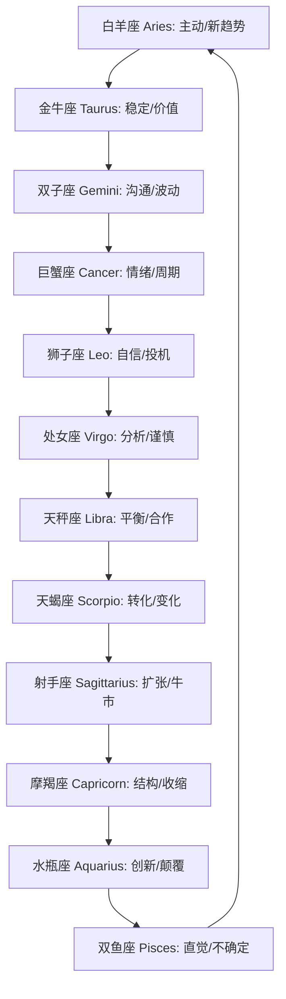
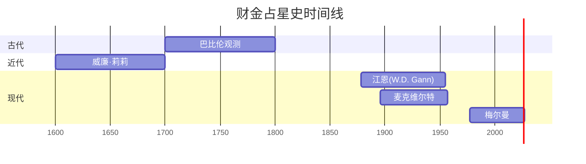
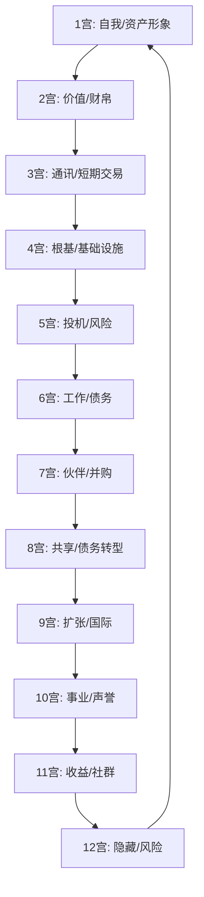
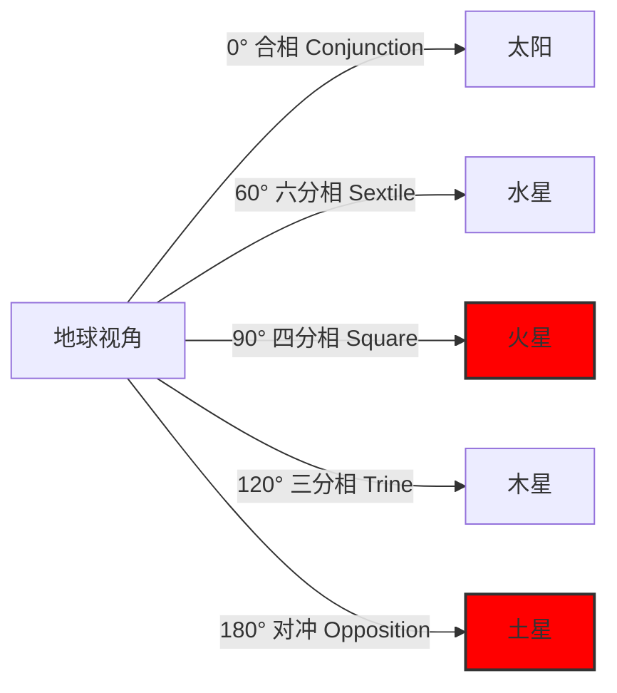
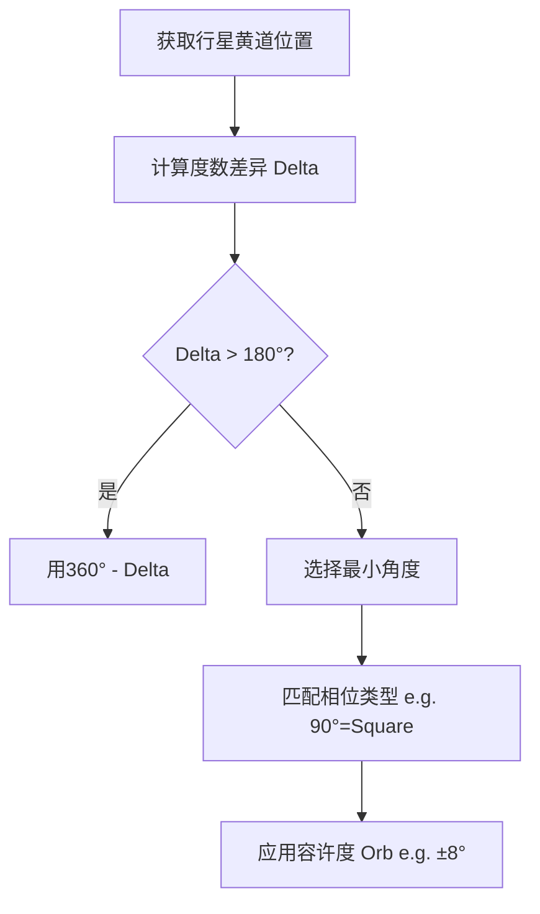

# 金融占星学：市场交易的宇宙节律与应用原理综合分析

## 初学者阅读指南 {#roadmap}

如果你完全是从零开始,建议按以下路径学习,以获得最佳理解与实践效果:

### 阶段一:地基(从这里开始)

1. 阅读第零章(见下文)——先掌握基础:星座、行星、相位(Aspect, 相位)、黄道(Ecliptic, 黄道)等核心概念。
2. 随读随查术语表——遇到生词即时查阅,加速内化。
3. 观察配图——至少花10分钟熟悉黄道轮与本命盘示意图。

### 阶段二:核心概念

4. 精读第二章2.1-2.6——理解占星如何映射到市场节律与交易行为。
5. 完成自测题1——检验星座与行星基础掌握情况。
6. 观看推荐视频(见“初学者资源推荐”)——通过可视化讲解加深对相位的理解。[^174][^175]

### 阶段三:应用上手

7. 阅读江恩与历史案例——理解大师如何在交易中应用占星节律。[^176][^177]
8. 生成你的第一个图表——在 Astro.com 建一张资产“首次交易”图表并标注关键相位。[^178][^179]
9. 完成自测题2——检验相位与宫位在市场应用中的理解。

### 阶段四:批判性思维

10. 阅读批评与方法论局限——理解科学质疑与数据挖掘偏差的风险。[^180][^181]
11. 学习布拉德利指标图——掌握其优势与限制,只将其视为“时间窗口”而非方向预测。[^182][^183]
12. 研读月相与市场研究——了解学术证据与可复现性。[^184][^185]

### 阶段五:进阶探索

13. 在掌握基础后,再学习T三角与二次推进等进阶技术。
14. 反复回看术语表——反复接触是形成直觉的关键。
15. 实战练习——连续6个月跟踪水星逆行与月相,记录市场表现并复盘。[^186][^187]

> 提示: 占星学在现代科学共同体中并未被视为“已证实的科学”,请将其作为象征性“择时框架”,结合技术面、基本面与风控共同使用,切勿单独决策。[^182][^180]

## 目录
- [初学者阅读指南](#roadmap)
- [第零章：占星学绝对基础（初学者）](#ch0)
- [引言：一种另类的市场视角](#intro)
- [第一部分：金融占星学的基础理论与工具](#part1)
  - [第一章：核心前提与历史轨迹](#ch1)
  - [第二章：金融分析师的星体工具箱](#ch2)
  - [第2.8章：星盘解读实战流程](#ch2-8)
  - [第三章：机器中的幽灵：天体市场异象的经验证据](#ch3)
- [第二部分：代表人物及其方法论](#part2)
  - [第四章：江恩之谜：几何、数学与占星学的融合](#ch4)
  - [第五章：梅尔曼方法：地球宇宙征象与市场周期](#ch5)
  - [第六章：其他重要贡献者](#ch6)
- [第三部分：实际应用与策略实施](#part3)
  - [第七章："首次交易"本命盘：资产的占星蓝图](#ch7)
  - [第八章：动态预测与市场择时](#ch8)
  - [第九章：跨市场策略与历史事件回顾](#ch9)
- [第四部分：批判性视角与结论](#part4)
  - [第十章：批判性视角](#ch10)
  - [第十一章：比较框架：占星学与主流分析方法](#ch11)
- [第五部分：现代应用与前沿发展](#part5)
  - [第十二章：现代量化工具与占星学整合](#ch12)
  - [第十三章：加密货币特有占星学应用](#ch13)
  - [第十四章：行为金融学与占星学交叉研究](#ch14)
  - [第十五章：实践工具与软件推荐](#ch15)
  - [第十六章：占星学风险管理框架](#ch16)
- [第六部分：初学者强化教学](#part6)
  - [第零章扩展：新手常见问题解答](#ch0-extend)
  - [第2.8章扩展：新手实战练习营](#ch2-8-extend)
 - [术语表(2.6A)](#glossary)
 - [附录B：图示与示例建议](#appendix-figs)
 - [附录C：自测题](#appendix-quizzes)
 - [附录D：初学者资源推荐](#appendix-resources)
 - [附录E：文化中立与科学声明](#appendix-disclaimer)
 - [附录F：星盘解读工作表使用指南](#appendix-f)
 - [附录G：BTCUSDT分步解盘示范](#appendix-g)
 - [结语](#outro)

## 第零章：占星学绝对基础(初学者) {#ch0}

在深入金融占星学之前,我们先用直观、可操作的方式打牢基础。可以把占星学想作“天空的天气学”:气象学家跟踪气压锋面预测风暴,占星师跟踪天体运动来识别可能影响地球事件的“宇宙天气”。[^174][^175]

### 0.1 占星学是什么?

占星学是一套古老的象征体系,研究行星位置与地面事件之间的对应关系。金融占星学关注行星周期与市场趋势、经济节律和交易行为的对照。重要提示:占星学并未被现代科学界视为“已证实的科学”;更适合作为一种“模式识别”与“象征时序”工具,与技术分析和基本面分析配合使用。[^176][^177][^178][^179][^180][^181][^182][^183]

### 0.2 天空像一座时钟:黄道(Ecliptic, 黄道)

太阳一年的“表盘轨迹”称为黄道,可理解为环绕地球的带状天路,行星大多沿此带运行。黄道被划分为12段,每段30度,形成十二星座。把它想像成一条圆形赛道:太阳每年跑完一圈;水星飞快(约88天一圈);土星缓慢(约29.5年)。金融占星师关心“选手”们的位置与他们之间的角度(相位, Aspect)。[^184][^185][^186]

### 0.3 地心 vs 日心

- 地心(Geocentric, 地心):以地球为参照的观测,是传统与金融占星的标准视角。
- 日心(Heliocentric, 日心):从太阳中心看行星真实轨道;部分财金研究用其观察长期经济周期。
建议初学使用地心视角,在研究大周期或商品时可对照日心。[^186][^187][^184]

### 0.4 十二星座:极简关键词

十二星座各占30度,为行星行为提供“风格背景”。以下为面向初学者的关键词:[^184][^185]

1) 白羊座 Aries——主动、行动、果断;市场:新趋势启动。
2) 金牛座 Taurus——稳定、价值、物质;市场:与财帛/第二宫相关。
3) 双子座 Gemini——沟通、数据、波动;市场:消息驱动。
4) 巨蟹座 Cancer——情绪、保护、周期;市场:月相与情绪。
5) 狮子座 Leo——自信、投机、戏剧;市场:高调走势。
6) 处女座 Virgo——分析、精确、谨慎;市场:细节交易。
7) 天秤座 Libra——平衡、合作、犹疑;市场:均衡与拉扯。
8) 天蝎座 Scorpio——转化、强度、隐秘;市场:深层结构变化。
9) 射手座 Sagittarius——扩张、乐观、冒险;市场:牛市与投机。
10) 摩羯座 Capricorn——结构、纪律、限制;市场:收缩与监管。
11) 水瓶座 Aquarius——创新、颠覆、群体;市场:科技与革命。
12) 双鱼座 Pisces——直觉、迷雾、溶解;市场:不确定与“信仰”。

###### 0.4.a 视觉辅助：黄道轮（Mermaid/ASCII）

在支持Mermaid的平台可直接渲染，纯文本环境使用ASCII备用。



```text
+-------------------+
|     黄道轮        |
| 白羊(主动) - 金牛(稳定)
|   |             |
| 双子(沟通)     双鱼(直觉)
|   |             |
| 巨蟹(情绪)     水瓶(创新)
|   |             |
| 狮子(自信)     摩羯(结构)
|   |             |
| 处女(分析)     射手(扩张)
|   |             |
| 天秤(平衡) - 天蝎(转化)
+-------------------+
```


黄道轮示意图: 十二星座、行星符号与宫位分区的整体布局。

### 0.5 十大行星:角色与类比

- 太阳 Sun ☉——核心与领导;市场:方向与领袖板块。
- 月亮 Moon ☽——情绪与反应;市场:情绪与日内波动。[^188][^189]
- 水星 Mercury ☿——沟通与思考;市场:数据/成交活跃;水星逆行常伴沟通失灵。[^190][^191]
- 金星 Venus ♀——价值与吸引;市场:货币/奢侈/美学趋势。
- 火星 Mars ♂——行动与冲突;市场:波动与能化板块。
- 木星 Jupiter ♃——扩张与幸运;市场:乐观与增长。
- 土星 Saturn ♄——限制与纪律;市场:回撤/监管/熊周期。
- 天王星 Uranus ♅——革命与惊奇;市场:突发拉崩与科技颠覆。
- 海王星 Neptune ♆——迷雾与灵性;市场:泡沫/不确定。
- 冥王星 Pluto ♇——权力与重生;市场:系统性重定价。[^188]


### 0.4.b 新手记忆图：十二星座象形符号

让我们用象形记忆法帮助初学者记住星座符号：

```
白羊♈ - 像羊角，冲锋向前
金牛♉ - 像牛头，稳固有力
双子♊ - 像罗马数字II，双胞胎
巨蟹♋ - 像螃蟹钳子，防御姿态
狮子♌ - 像狮子鬃毛，王者风范
处女♍ - 像少女手持麦穗，纯洁勤劳
天秤♎ - 像天平秤盘，平衡公正
天蝎♏ - 像蝎子尾刺，毒辣深沉
射手♐ - 像弓箭手，扩张进取
摩羯♑ - 像山羊鱼尾，稳健攀登
水瓶♒ - 像水从瓶中倾泻，创新流动
双鱼♓ - 像两条游动的鱼，梦幻迷离
```

### 0.4.c 星座性格象形图


**象形记忆提示：**
- 白羊：冲锋的羊 → 行动派，喜欢先发制人
- 金牛：吃草的牛 → 务实，喜欢物质享受
- 双子：双胞胎 → 多变，喜欢沟通交流
- 巨蟹：带壳的蟹 → 防御，重视家庭安全
- 狮子：咆哮的狮 → 自信，喜欢被关注
- 处女：挑剔的少女 → 完美主义，注重细节
- 天秤：平衡的天平 → 公正，喜欢和谐关系
- 天蝎：毒刺的蝎 → 深刻，喜欢深度探索
- 射手：射箭的手 → 冒险，喜欢自由扩张
- 摩羯：爬山的羊 → 野心，喜欢长期规划
- 水瓶：倾倒的水瓶 → 创新，喜欢独特想法
- 双鱼：游动的鱼 → 敏感，喜欢幻想世界

过渡:理解星座与行星后,金融占星把这些符号应用到“市场图”而非“个人本命”。例如,不问“我太阳在狮子意味着什么?”,而问“太阳入摩羯对股市意味着什么?”江恩(W.D. Gann)在20世纪初率先将天体节律用于交易,但出于法律环境常以“自然科学”措辞呈现。[^176][^192][^185]

### 0.6 新手常见问题解答

**Q: 我是完全的占星学小白，如何开始学习？**
A: 建议按以下步骤：
1. 先记住12星座的顺序和基本特质（就像记住颜色一样）
2. 理解10大行星的基本"性格"（太阳=领导，月亮=情绪等）
3. 学会看相位（角度关系，就像几何学）
4. 理解宫位（就像房屋的房间分工）

**Q: 星座和星期的关系？**
A: 星座与一周7天的行星守护有关：
- 星期日(Sunday) - 太阳
- 星期一(Monday) - 月亮
- 星期二(Tuesday) - 火星（Tiu是北欧战神）
- 星期三(Wednesday) - 水星（Woden是北欧智慧神）
- 星期四(Thursday) - 木星（Thor是北欧雷神）
- 星期五(Friday) - 金星（Frigg是北欧爱神）
- 星期六(Saturday) - 土星（Saturn是罗马时间神）

**Q: 如何快速记忆行星符号？**
A:
- ☉太阳：像太阳光芒四射
- ☽月亮：像月牙
- ☿水星：像带翅膀的头盔（信使）
- ♀金星：像镜子（美丽）
- ♂火星：像盾牌和矛（战争）
- ♃木星：像闪电（宙斯的神力）
- ♄土星：像镰刀（时间与收割）
- ♅天王星：像接收器（创新）
- ♆海王星：像三叉戟（海神）
- ♇冥王星：像PL的组合（冥界）

### 0.7 行星的日常生活类比

为了让初学者更容易理解，让我们用日常生活场景来类比行星：

**太阳☉ - 公司CEO**
- 制定公司方向和愿景
- 代表权威和领导力
- 市场类比：股市的整体趋势和领导板块

**月亮☽ - 公司HR总监**
- 处理员工情绪和福利
- 关注公司氛围和团队合作
- 市场类比：日内情绪波动和散户行为

**水星☿ - 公司IT总监**
- 负责沟通、信息传递和技术
- 管理数据流和交易系统
- 市场类比：消息面影响和技术故障

**金星♀ - 公司市场总监**
- 负责品牌形象和客户关系
- 关注美学和价值定位
- 市场类比：奢侈品、货币和审美趋势

**火星♂ - 公司销售总监**
- 推动行动、竞争和执行力
- 处理冲突和高压情况
- 市场类比：波动性和能源板块

**木星♃ - 公司扩张总监**
- 寻求成长机会和投资
- 代表乐观和扩张精神
- 市场类比：牛市和成长板块

**土星♄ - 公司风控总监**
- 制定规则、限制和风控
- 关注长期稳定和合规
- 市场类比：熊市和监管压力

**天王星♅ - 公司创新总监**
- 推动变革和颠覆性创新
- 处理突发事件和新技术
- 市场类比：科技股和突发波动

**海王星♆ - 公司创意总监**
- 处理模糊概念和理想主义
- 关注品牌故事和情感价值
- 市场类比：概念股和市场泡沫

**冥王星♇ - 公司战略总监**
- 处理权力斗争和深度变革
- 关注生死存亡的重大决策
- 市场类比：系统性风险和市场重塑

### 0.8 新手练习：星座快速配对游戏

让我们通过游戏来记忆星座和行星的对应关系：

**练习1: 星座守护行星配对**
请将左边的行星与右边的星座配对：

行星：
1. 火星
2. 金星
3. 水星
4. 月亮
5. 太阳

星座：
A. 双子座、金牛座（处女座）
B. 巨蟹座
C. 白羊座、天蝎座
D. 金牛座、天秤座
E. 狮子座

答案：1-C, 2-D, 3-A, 4-B, 5-E

**练习2: 星座元素分类**
请将星座按元素分类：

火象（行动型）：白羊座、狮子座、射手座
土象（物质型）：金牛座、处女座、摩羯座
风象（思维型）：双子座、天秤座、水瓶座
水象（情感型）：巨蟹座、天蝎座、双鱼座

**练习3: 相位角度计算**
计算以下行星位置的相位：
- 太阳在15°白羊座，水星在15°金牛座 → 30° → 半合相
- 月亮在10°巨蟹座，火星在10°天秤座 → 90° → 四分相
- 金星在20°狮子座，木星在20°射手座 → 120° → 三分相

### 0.9 初学者常犯的10大错误

1. **只看太阳星座**：忽略月亮、上升等其他重要因素
2. **过度解读单一相位**：忽略整体格局和多重因素
3. **混淆占星学与天文学**：忘记占星学是象征体系，不是科学事实
4. **忽略文化背景**：不同文化对占星学的解读差异很大
5. **过度自信预测**：将占星学当作精确预测工具而非概率指引
6. **忽略宫位系统**：只关注星座而忽略宫位的重要性
7. **忘记时间敏感性**：占星学解读随时间变化，需要持续观察
8. **过度简化复杂问题**：将复杂市场现象归结为单一占星学因素
9. **忽略个人偏见**：让个人信念影响客观解读
10. **脱离实际验证**：不与真实市场数据进行对照验证

### 0.10 新手学习路径图

```
零基础入门
    ↓
[第零章] 基础概念
    ↓
记住12星座顺序和特质
    ↓
理解10大行星"性格"
    ↓
学会相位角度计算
    ↓
理解宫位基本概念
    ↓
[第2.8章] 实战解盘练习
    ↓
分析个人/资产出生图
    ↓
跟踪月相和水星逆行
    ↓
记录市场表现对照
    ↓
形成个人解读风格
```

---

## 引言：一种另类的市场视角 {#intro}

本报告旨在对金融占星学进行一次全面而深入的探讨,整合其基础理论、关键方法论、实际应用策略以及批判性观点。金融占星学,亦称商业或经济占星学,是一种研究天体运动与金融市场事件之间潜在关联的实践。其核心思想源于古老的赫尔墨斯主义格言"天上地下,相互辉映"(As above, so below),即认为天界(宏观宇宙)的模式会反映在地球(微观宇宙)的事件中,其中也包括经济活动。

本分析旨在解构金融占星学的核心工具,并将其应用于具体资产(如BTCUSDT)的本命盘分析中,同时探索动态预测技术,以识别潜在的机遇与风险时期。其目标并非提供决定性的价格预测,而是为理解市场心理、周期性及其潜在的原型叙事提供一个补充性的分析框架。在承认该领域存在广泛怀疑论的前提下,本报告将金融占星学定位为一种定性的、象征性的工具。它旨在探索天体模式与市场行为之间的"相关性"而非"因果关系",以增强而非取代技术分析和基本面分析等传统的量化方法。

金融占星学通常被视为伪科学,但它实际上是一个复杂的课题,处于行为金融学、市场异象、文化历史和认知心理学的交叉点。核心挑战在于,如何调和那些已在同行评审的学术期刊上发表、显示天体与市场之间存在统计学显著相关的研究,与缺乏科学上公认的因果机制这一事实。本报告将从最稳健的经验数据出发,经过历史和方法论背景的梳理,最终对其中涉及的心理现象进行批判性分析。

## 第一部分：金融占星学的基础理论与工具 {#part1}

本部分旨在为金融占星学建立理论与历史基础,并详细阐述构成其分析核心的"星体工具箱"。

### 第一章：核心前提与历史轨迹 {#ch1}

#### 1.1 理论框架：市场情绪、群体心理与宇宙周期

与建立在基本面或市场数据之上的传统金融理论不同,金融占星学提出,行星的位置能够影响市场趋势和投资者的决策过程。它并非主张行星通过某种物理力量直接操控股票价格,而是认为天体周期性地影响着构成市场的集体情绪——即乐观、恐惧、扩张与收缩的循环。

这种作用机制的本质是心理学的,而非物理学的。其逻辑链条并非"行星 → 股价",而是"行星 → 人类心理 → 交易决策 → 市场集体行为 → 股价"。该理论试图解释为何市场在基本面看似稳定的情况下,仍会经历剧烈的周期性波动,为市场中难以用传统模型量化的"动物精神"提供一个可供参考的节律性框架。更有甚者,一些支持者认为,如果足够多的交易者依据占星预测采取行动,他们的集体行为本身就可能创造出自我实现的预言,从而间接影响市场动态。

金融占星学的理论核心在于,它假定宇宙周期与人类的集体心理之间存在共振。行星的运行周期被视为一种宏观节律,它通过影响人类情绪的潮汐涨落,进而驱动市场情绪的变化。这种观点认为,市场的非理性繁荣与恐慌性抛售,并非完全由经济数据驱动,也可能受到这些更宏大、更古老的宇宙模式的影响。

#### 1.2 历史轨迹：从巴比伦观测到华尔街实践

金融占星学的起源可追溯至古代文明。约公元前1700年的巴比伦,人们已将天体观测与经济预测联系起来,例如通过行星运动预测农业产量。在16至17世纪,威廉·莉莉(William Lilly)等占星师已开始将行星事件与金融危机联系起来。进入20世纪,随着现代市场的兴起,江恩(W.D. Gann)和路易斯·麦克维尔特(Louise McWhirter)等人发展出将占星学系统性地应用于市场分析的方法。

进入20世纪,该领域迎来了三位关键先驱人物：W.D. 江恩(1878-1955),这位传奇交易员将几何学、数学和占星学融合成一套复杂的市场分析体系；路易斯·麦克维尔特(1896-1957),她出版了《占星学与股市预测》,核心理论是商业活动和金融的主要趋势由北交点的18.6年周期清晰指示；当代实践者如雷蒙德·梅尔曼自1977年起发行通讯,将"地球宇宙研究"与传统市场周期分析相结合,阿奇·克劳福德从美林证券转型为全职占星交易顾问,他的预测成就包括1987年、1994年、2002年和2008年的主要市场崩盘。目前,至少有300名交易员每年支付237美元订阅金融占星师的通讯。[^1][^2]

###### 1.2.a 视觉辅助：财金占星史时间线（Mermaid/ASCII）



```text


时间线: 巴比伦(-1700) --> 莉莉(16C) --> 江恩(1878-1955) --> 梅尔曼(1977-今)
```

### 第二章：金融分析师的星体工具箱 {#ch2}

本节将解构从业者用于监测和解读市场的具体占星学现象。行星代表市场活动中的主动原则,黄道星座如同"背景"或"环境"修饰着行星的行动,而宫位则代表了金融生活的特定领域。

#### 2.1 天体原型：行星对市场动态的影响

每颗行星都具有独特的金融意涵,代表了市场活动中的"行为主体"。

**表1：行星在金融市场中的意涵**


| 行星 | 原型/原则 | 市场相关性 (看涨/看跌/波动) | 主管行业 |
| :-- | :-- | :-- | :-- |
| 太阳 | 核心身份、领导力 | 看涨/稳定 | 黄金、娱乐、领导层 |
| 月亮 | 公众情绪、日常需求 | 波动 | 房地产、食品、服务业 |
| 水星 | 交易、通讯、数据 | 波动/短期 | 媒体、交通、科技、商业 |
| 金星 | 价值、货币、和谐 | 看涨 | 奢侈品、艺术、美妆、消费品 |
| 火星 | 行动、投机、冲突 | 波动/高风险 | 国防、钢铁、能源、制造业 |
| 木星 | 扩张、乐观、增长 | 强烈看涨/泡沫 | 银行、国际贸易、法律、出版 |
| 土星 | 结构、限制、恐惧 | 看跌/盘整 | 政府、建筑、矿业、农业 |
| 天王星 | 颠覆、创新、突变 | 极端波动 | 科技、航空、电力、加密货币 |
| 海王星 | 幻觉、投机、欺诈 | 波动/非理性 | 石油、制药、航运、电影 |
| 冥王星 | 转型、权力、债务 | 极端/系统性风险 | 保险、债务、税收、核能 |

#### 2.2 黄道框架：经济领域与市场情绪指标

黄道十二星座为行星的行动提供了风格和背景,并与特定的经济领域相关联。

**表2：黄道星座对经济领域和市场风格的主导**


| 黄道星座 | 主宰行星 | 市场风格/情绪 | 相关经济领域 |
| :-- | :-- | :-- | :-- |
| 白羊座 | 火星 | 侵略性、高交易量、风险偏好 | 国防、钢铁、初创企业、科技、加密货币 |
| 金牛座 | 金星 | 保守、稳定、价值导向 | 银行、房地产、农业、奢侈品 |
| 双子座 | 水星 | 波动、消息驱动、高换手率 | 通讯、媒体、交通、数据 |
| 巨蟹座 | 月亮 | 情绪化、安全驱动、防御性 | 房地产、食品、日用消费品、酒店业 |
| 狮子座 | 太阳 | 投机性、高调、自信 | 黄金、娱乐、领导力、奢侈品牌 |
| 处女座 | 水星 | 分析性、谨慎、注重细节 | 医疗保健、会计、服务业、卫生行业 |
| 天秤座 | 金星 | 平衡、伙伴关系导向、寻求均衡 | 艺术、时尚、外交、法律 |
| 天蝎座 | 冥王星/火星 | 激烈、神秘、转型 | 保险、债务、矿业、能源、区块链 |
| 射手座 | 木星 | 扩张性、乐观、国际化 | 全球贸易、出版、高等教育、旅游 |
| 摩羯座 | 土星 | 结构化、长期、制度化 | 政府、银行、建筑、传统产业 |
| 水瓶座 | 天王星/土星 | 创新、颠覆、技术性 | 科技、航空、社交网络、加密货币 |
| 双鱼座 | 海王星/木星 | 投机性、虚幻、敏感 | 石油、航运、制药、电影、非营利组织 |

#### 2.3 世俗宫位：金融活动的舞台

十二宫位代表了金融生活的特定领域,为行星能量提供了具体的表现舞台。

###### 2.3.a 视觉辅助：宫位轮（Mermaid/ASCII）



```text
宫位轮:
  1(自我) --- 2(价值) --- 3(通讯)
   |                    |
 12(隐藏)           4(根基)
   |                    |
 11(收益) --- 10(事业) --- 9(扩张)
```


- 第一宫 (自我/身份)：资产的公众形象和基本特征。
- 第二宫 (价值/资产)：即"财帛宫",掌管有形资产、收入和内在价值。
- 第三宫 (通讯)：网络、数据、新闻流、短期交易。
- 第四宫 (根基)：资产的"大本营"、基础设施和长期安全。
- 第五宫 (投机)：即"赌博宫",主宰投机交易、风险和投资者的创造力。
- 第六宫 (工作/债务)：日常运营、实用性和负债。
- 第七宫 (伙伴关系)：并购、合同、与其他资产/交易所的关系。
- 第八宫 (共享资源)："他人的钱财"——债务、保险、税收、风险投资和深度转型。
- 第九宫 (扩张)：国际市场、法规/法律、长期愿景。
- 第十宫 (事业/声誉)：公众地位、历史高点、在更广泛市场中的角色。
- 第十一宫 (收益/社群)：即"福德宫",代表利润、网络效应、社群和机构接纳度。
- 第十二宫 (隐藏因素)：看不见的风险、欺诈、瓦解和幕后活动。


#### 2.4 影响力的几何学：相位、周期与关键时点

行星之间的角度关系(相位)和周期性运动是判断市场动态、波动性和转折点的关键。

- **行星相位**：
    - 硬相位(合相0°、冲相180°、刑相90°)：通常与紧张、波动、市场回调和趋势反转相关。合相往往标志着一个新周期的开始。
    - 软相位(三分相120°、六分相60°)：被认为是和谐的,与稳定、积极的势头以及现有趋势的平稳延续相关。
- **长期行星周期**：运行缓慢的外行星周期是理解宏观经济环境和长期市场趋势的关键,被认为与经济的扩张与收缩、结构性转变相关联。
    - 木星周期 (约12年)：通常与经济扩张、乐观情绪和牛市联系在一起。
    - 土星周期 (约29.5年)：与经济收缩、谨慎、衰退和熊市相关。
    - 木土合相 (约20年)：被视为指示经济周期和市场范式发生长期转变的最重要指标之一。历史记录显示,在所有记录的全球经济衰退期间——1970年、1974-75年、1980-83年、1990-93年、2001-2002年和2008-09年——木星与土星要么处于对冲,要么处于合相状态。[^3]
    - 关键周期相关性：1921年木土合相标志着"咆哮的二十年代"的开始；1940-1941年与第二次世界大战同时发生；1980-1981年美国经济进入深度衰退；2000年互联网泡沫破裂；2020年新冠疫情对全球金融系统造成破坏。[^3]
    - **2020-2025木土周期的最新发展**：2024-2025年的木星-土星刑相位(square)引发市场关注。2024年8月开始的中心时段一直持续到2025年6月15日。第一次精确相位发生时,市场出现对经济放缓的真正担忧,促使美联储恐慌性降息50个基点。2024年12月的第二次相位出现时,鲍威尔表示进一步降息的必要性存在疑问。市场定价显示下一次降息可能在2025年6月18日,正好是最后一次木土刑相位后三天。第三次也是最后一次相位发生在2025年6月,此时木星和土星都处于顺行,但分别位于巨蟹座和白羊座。木星在巨蟹座旺相,而土星在白羊座落陷,这种配置可能意味着扩张能量被放大而收缩能量衰减,预示着比市场当前预期更激进的刺激政策。[^4]
    - 外行星 (天王星、海王星、冥王星)：其更长的周期被认为与世代性的变革、技术革命和系统性转型有关。
- **短期择时工具**：
    - 行星逆行：特别是水星逆行(每年3-4次),与交易/通讯相关的操作性风险上升。参见第三章3.3对跨国证据与机制渠道的系统回顾与结论要点。[^5][^6][^7][^8][^9]
    - 月相周期 (约29.5天)：新月/满月常被视为情绪节点。参见第三章3.1对全球多国与中国样本的量化证据、方法与局限的汇总。[^10][^11][^12][^13]
    - 日食与月食：被视为变革与不确定性的强催化剂,可能对应重大的市场转变或反转。由于事件样本数量有限,应将其作为"风险窗口"管理而非确定性信号,结合价量确认更为稳妥。**历史案例**：道琼斯历史样本的事件研究显示,日全食当年年末收高比例较高,但样本极小,统计功效不足,易受数据挖掘影响。[^14]


#### 2.5 相位容许度与权重(Orbs \& Weighting)

- 推荐容许度(行运→本命)：
    - 硬相位：合/冲 5°；刑 4°。
    - 软相位：拱 3°；六合 2°。
    - 月亮相关：新/满月触发对本命关键点位时,可放宽至 6°；配合较短事件窗。
    - 外行星精确作用(如土星、天王星、冥王星)可在精确前后维持影响,辅以更宽事件窗(见下文"事件窗口")。
- 权重建议(用于信号打分与组合)：
    - 行星权重：外行星 > 社会行星(土星/木星) > 个人行星(火金水) > 月亮触发。
    - 相位权重：硬相位(合/冲/刑) > 软相位(拱/六合)。
    - 宫位权重：作用于第2/5/8/10/11宫的事件通常对市场更敏感。
    - 容许度折减：距离精确角度差 d 时,可采用线性或高斯衰减 w(d) = max(0, 1 - d / orb)。
    - 事件聚簇：同窗内多重相位叠加时,可叠加或上限裁剪,避免过拟合。


#### 2.6 行星相位：金融占星学的几何密码 —— 完全初学者指南

在金融占星学中，仅仅了解行星的个别特质是远远不够的。正如交响乐团中每种乐器都有其独特的声音，但真正的美妙在于它们的和声与对位，行星之间的相位关系才是揭示市场节奏和价格波动的关键密码。

##### 2.6.1 什么是相位？—— 从零开始的概念建构

**相位的基础定义**

###### 2.6.a 视觉辅助：相位示意（Mermaid/ASCII）




```text
时钟视角 (0° 在12点):
    12: 合相 (0°)
     |
     2: 六分相 (60°)
     |
     3: 四分相 (90°)
     |
     4: 三分相 (120°)
     |
     6: 对冲 (180°)
```

相位(Aspect)是指两颗行星或行星与重要点之间在黄道上形成的角度关系。想象你站在地球中心向外看，太阳在你的正前方，月亮在你的右侧，那么从你的位置看，太阳和月亮之间的夹角就是它们的相位。

**视觉化理解方法**

将星盘想象成一个圆形钟表：
- 整个圆盘代表360度的黄道
- 每个星座占30度(360÷12=30)
- 行星就像钟表指针，位于不同的度数上
- 两根“指针”之间的角度就是相位

**相位的地球中心视角**

相位基于地心视角计算。虽然天文学上地球绕太阳运转，但占星学采用从地球观察的视角，因为我们关心的是从地球人类角度看到的天象。

##### 2.6.2 相位计算方法 —— 精确到每一度

**基础计算步骤**

要计算两颗行星之间的相位：
1. 确定行星的黄道位置
   - 例：太阳在狮子座15°(总计135°)；月亮在天蝎座15°(总计225°)
2. 计算度数差异
   - 225° - 135° = 90° → 四分相
3. 选择较小角度
   - 若结果>180°，用360°-该值
   - 例：270° → 360°-270°=90°

###### 2.6.2.b 视觉辅助：相位计算流程（Mermaid/ASCII）



```text
位置 --> 差异 --> (若>180: 360-差异) --> 最小角 --> 匹配相位 --> 容许度检查
```

###### 2.6.2.a 视觉辅助:用钟表来算相位

把星盘想成12小时的钟面:[^185]

- 合相(0°): 两根“指针”指向同一数字,能量叠加。
- 六合(60°): 相差2小时(如12点与2点),温和协同。
- 刑相(90°): 相差3小时(如12点与3点),张力与挑战。
- 拱相(120°): 相差4小时(如12点与4点),顺畅流动。
- 对冲(180°): 相差6小时(如12点与6点),对立与平衡。

计算窍门: 一圈360°,每星座30°。例如,白羊15°到狮子15°=4个星座×30°=120°(拱相)。双子10°到射手10°=6个星座×30°=180°(对冲)。容许度:主要相位常取±8°(六合±4°)。若火星15°白羊、土星23°巨蟹,夹角98°,落在90°±8°范围内,仍作刑相处理。[^186][^187]

**跨星座计算实例**

- 金星位于双子座28°
- 火星位于处女座2°

计算：
1. 金星总度数：2×30+28=88°(双子座为第3宫区，前有2个星座)
2. 火星总度数：5×30+2=152°(处女座为第6个星座)
3. 度数差：152-88=64°
4. 判断相位：64°接近60°且在容许度内 → 六分相

##### 2.6.3 容许度(Orb)—— 相位影响力的边界

**容许度的核心概念**

容许度回答：两颗行星的角度要多精确才算一个“有效相位”。现实中精确角度极罕见，容许度提供合理的误差范围。

**现代占星学的标准容许度**

| 相位类型 | 精确角度 | 标准容许度 | 实际范围 |
|:--|:--|:--|:--|
| 合相 | 0° | ±8° | 352°-8° |
| 六分相 | 60° | ±4° | 56°-64° |
| 四分相 | 90° | ±8° | 82°-98° |
| 三分相 | 120° | ±8° | 112°-128° |
| 对分相 | 180° | ±8° | 172°-188° |

**古典占星学的行星差异化容许度**

| 行星 | 古典容许度 | 现代简化 | 光度特征 |
|:--|:--|:--|:--|
| 太阳 | ±15°-17° | ±8° | 最亮，影响力最大 |
| 月亮 | ±12°-12.5° | ±8° | 明亮，变化快速 |
| 水星 | ±7° | ±6° | 较小，靠近太阳 |
| 金星 | ±7°-8° | ±6° | 明亮，但体积小 |
| 火星 | ±7.5°-8° | ±6° | 较暗，影响力集中 |
| 木星 | ±9°-12° | ±8° | 巨大，影响深远 |
| 土星 | ±9°-10° | ±6° | 缓慢，持久影响 |


**金融占星学的容许度应用原则**

- 主要相位(0°, 90°, 180°, 120°)：±6-8°
- 六分相(60°)：±3-4°
- 次要相位：±2-3°

##### 2.6.4 托勒密主相位系统 —— 五大核心相位详解

现代占星学的主要相位系统源自托勒密(2世纪)，称为“托勒密相位”。

###### 2.6.4.1 合相(Conjunction, 0°)—— 能量的完全融合

**几何特征**
- 精确角度：0°；容许度：±8°；符号：☌；视觉特征：两星几乎重叠

**能量特质**
两种行星能量完全融合，可能强化，也可能混乱。

**金融占星中的表现**
- 新周期的开始：常标志新趋势启动
- 能量集中：价格易出现显著突破或反转
- 方向不确定：需结合参与行星性质判断

**案例**
- 太阳-木星合相：乐观与上涨压力
- 火星-土星合相：谨慎与调整
- 水星-海王星合相：传言与不实信息

###### 2.6.4.2 对分相(Opposition, 180°)—— 极性的对立与平衡

**几何特征**
- 精确角度：180°；容许度：±8°；符号：☍；视觉：两星正对

**能量特质**
相反力量的对峙，带来高度觉知与外在紧张。

**金融表现**
- 价格极化：重要高低点
- 情绪对立：多空势均力敌
- 政策分歧/国际紧张：地缘影响增强

**心理层面**
- 理性与情绪的冲突
- 长期策略与短期冲动的拉扯
- 风险偏好与安全需求的平衡

###### 2.6.4.3 四分相(Square, 90°)—— 成长的挑战与突破

**几何特征**
- 精确角度：90°；容许度：±8°；符号：□；视觉：直角关系

**能量特质**
成长阻力促生突破，非对分的正面冲突。

**金融表现**
- 调整压力与阻力测试
- 波动性上升
- 突破契机(化解阻力后)
- 监管挑战与新规阻力

###### 2.6.4.4 三分相(Trine, 120°)—— 和谐的能量流动

**几何特征**
- 精确角度：120°；容许度：±8°；符号：△

**能量特质**
能量顺畅、机遇与天赋，但爆发力偏弱。

**金融表现**
- 趋势延续与流动性充足
- 情绪稳定
- 突破动能有限

**元素关系**
- 火象三分(白羊-狮子-射手)：激情与扩张
- 土象三分(金牛-处女-摩羯)：务实与建构
- 风象三分(双子-天秤-水瓶)：沟通与创新
- 水象三分(巨蟹-天蝎-双鱼)：情感与深度

###### 2.6.4.5 六分相(Sextile, 60°)—— 潜在的机会窗口

**几何特征**
- 精确角度：60°；容许度：±4°；符号：⚹

**能量特质与金融表现**
- 潜在机会与支援；需主动行动激活
- 良好入场/出场时点；为主趋势提供助推

##### 2.6.5 次要相位系统 —— 精细化的市场信号

除五大相位外，次要相位用于精细化分析。

**半相位系列**
- 八分相(Semi-square, 45°)：±2°；轻微摩擦与不安 → 小幅波动、短期调整
- 八分之三相(Sesquisquare, 135°)：±2°；低级紧张 → 进展缓慢、拖延效应
- 十二分相(Semi-sextile, 30°)：±2°；微弱支援 → 温和技术支撑
- 补十二分相(Quincunx, 150°)：±2°；不协调 → 结构不平衡、需调整

**五分相系列(创造力相关)**
- 五分相(Quintile, 72°)：±2°；创造潜能 → 创新策略、新兴行业机会
- 倍五分相(Biquintile, 144°)：±2°；创造实现 → 创新商业化成功

##### 2.6.6 相位的时效性与动态分析

**入相位与出相位**
- 入相位：快行星接近慢行星形成精确相位，能量增强 → 趋势酝酿、情绪累积
- 出相位：快行星远离精确相位，能量减弱 → 趋势尾声、影响消退
- 精确相位：影响峰值 → 事件高概率时间窗

**紧密度分析**
- 紧密度优先：偏差小往往强于类型优势
- 分级：超紧密(0°-1°) > 紧密(1°-3°) > 中等(3°-5°) > 宽松(5°-8°)

##### 2.6.7 四轴点与相位 —— 个人化的市场影响

**四轴点基础**
- 上升(ASC)：第1宫宫头，身份/外显
- 天顶(MC)：第10宫宫头，事业/地位
- 下降(DSC)：第7宫宫头，合作/竞争
- 天底(IC)：第4宫宫头，根基/内在

**在金融占星中的应用**
- 资产IPO盘：
  - ASC附近行星：市场形象与第一印象
  - MC附近行星：长期潜力与社会影响
  - DSC附近行星：外部挑战与竞争
  - IC附近行星：内在价值与基础动机
- 行运行星对四轴的相位：常对应价格转折或发展节点

##### 2.6.8 相位强度权重系统

**相位影响力排序**
- 一级：合相(0°)；对分相(180°)；四分相(90°)
- 二级：三分相(120°)；六分相(60°)
- 三级：补十二分相(150°)；八分之三相(135°)；八分相(45°)
- 四级：十二分相(30°)；五分相系列(72°, 144°)

**多重相位的综合分析**
- 相位网络效应：多个相位叠加更常见
- T三角：两个刑相+一个冲相 → 高压与转折
- 大三角：三拱 → 稳定延续
- 大十字：四刑 → 重大危机或突破

##### 2.6.9 实战应用：相位分析的操作流程

**第一步：基础数据收集**
1) 确定分析对象(资产/事件的时间地点)并绘制精确星盘
2) 识别行星与四轴位置，计算相位角度

**第二步：相位识别与分类**
1) 主要相位扫描：按紧密度排序，优先≤3°，关注太阳/月亮/四轴
2) 相位强度评估：精确度、参与行星重要性与吉凶倾向

**第三步：综合解释与预测**
1) 相位网络分析：识别格局、分析组合效应、评估能量流向与阻滞
2) 时效性分析：分入/出相位，预测时间窗口，结合行运做前瞻

**第四步：风险评估与策略制定**
1) 风险点识别：标注高风险配置，预测转折点与系统性风险
2) 投资策略：基于相位择时、设定风控参数、规划长期节奏

重要提示：相位分析不是水晶球，而是理解市场心理周期与能量变化的工具。它的价值在于识别可能的转折点与趋势变化，帮助做出更理性、更有策略的决策。更多参考来源见文末脚注[^123]-[^173]。


#### 2.7 参考系与测度：热带/恒星、地心/日心、赤纬相位

### 第2.8章：星盘解读实战流程——从零到一的六步系统化方法 {#ch2-8}


> 本章目标:为读者提供一套可操作的星盘解读标准流程,从拿到星盘的第一眼到形成完整解读报告,建立清晰的思维路径。无论你是完全零基础的初学者,还是已有理论知识但不知如何下手的进阶者,都能通过本章的六步法快速上手实战解盘。

---

## 为什么需要系统化解盘流程?

许多占星初学者在学完行星、星座、宫位、相位等基础知识后,面对一张完整星盘时仍然感到无从下手。这就像学会了汽车各个零件的名称和功能,却不知道如何启动和驾驶汽车。

**常见困惑包括:**
- "星盘上这么多信息,我应该先看哪里?"
- "太阳、月亮、上升都重要,但哪个更优先?"
- "10颗行星×12个宫位×5种主要相位 = 600种组合,如何不被淹没?"
- "空宫是不是意味着那个生活领域不重要?"

本章提出的**六步解盘法**将帮助你:
1. **建立优先级体系** — 明确哪些信息是"主角",哪些是"配角"
2. **形成系统思维** — 从整体到局部,从宏观到微观,层层递进
3. **避免常见陷阱** — 识别并规避初学者最容易犯的解读错误
4. **提升解读效率** — 30分钟内完成一张星盘的核心要点提取

---

## 六步解盘法总览

| 步骤 | 核心任务 | 时间分配 | 输出成果 |
|------|----------|----------|----------|
| **第一步** | 整体印象分析 | 5-10分钟 | 元素/性质分布图,行星半球偏向 |
| **第二步** | 锁定核心三要素 | 5分钟 | 太阳-月亮-上升的基本画像 |
| **第三步** | 四轴点行星检视 | 3-5分钟 | 重大事件时间窗口标记 |
| **第四步** | 行星落宫逐一解读 | 10分钟 | 12宫位能量分布表 |
| **第五步** | 相位网络梳理 | 5-7分钟 | 紧密相位清单(≤3°) + 相位格局识别 |
| **第六步** | 空宫宫主星追踪 | 3-5分钟 | 空宫能量流向图 |

**总计:** 约30-40分钟完成一张星盘的骨架解读,后续可根据需要深入细化。

---

## 第一步:整体印象分析(5-10分钟)

> **目标**:在深入细节之前,先用"鸟瞰"视角掌握这张星盘的整体能量特质。

### 1.1 元素比重统计

**统计范围**:太阳、月亮、水星、金星、火星、木星、土星 + 上升点 + 天顶 **=共9个点**

**为什么不统计天王星/海王星/冥王星?**
- 三王星运行缓慢,同一时期出生的人都有相同配置,属于"世代特征"而非"个人特质"
- 统计三王星会稀释个人行星的权重,导致元素分析失真

**四元素分类表**:

| 元素 | 对应星座 | 关键词 | 缺乏时的表现 |
|------|----------|--------|--------------|
| **火** | 牡羊/狮子/射手 | 行动力、直觉、热情、冒险 | 缺乏主动性,等待外界推动 |
| **土** | 金牛/处女/摩羯 | 实际、感官、稳定、务实 | 缺乏执行力,想法难以落地 |
| **风** | 双子/天秤/水瓶 | 思考、沟通、逻辑、社交 | 难以客观分析,过度情绪化 |
| **水** | 巨蟹/天蝎/双鱼 | 情感、直觉、同理心、敏感 | 情感钝化,难以与人建立深度连结 |

**判断标准**:
- **强势元素**(≥4个点):此人最明显的行为模式和优势领域
- **平衡元素**(2-3个点):日常可调用的能量,不会特别突出
- **弱势元素**(0-1个点):生命课题所在,需要刻意学习和补强的领域

**案例示范**:
```
某星盘统计结果:
火元素:3个(太阳牡羊、火星射手、天顶狮子)
土元素:1个(水星金牛)
风元素:4个(月亮双子、金星天秤、木星水瓶、上升天秤)
水元素:1个(土星巨蟹)


→ 初步画像:风-火组合主导,擅长快速思考和行动,但可能缺乏耐心(土弱)和情感深度(水弱)。
```

### 1.2 性质(模式)比重统计

**三种性质(Modality)**:

| 性质 | 对应星座 | 特质 | 过多时 | 过少时 |
|------|----------|------|--------|--------|
| **基本** | 牡羊/巨蟹/天秤/摩羯 | 开创、主动、领导 | 只会开始不会完成 | 缺乏主导性,被动等待 |
| **固定** | 金牛/狮子/天蝎/水瓶 | 稳定、坚持、固执 | 过度僵化,难以改变 | 三分钟热度,无法深耕 |
| **变动** | 双子/处女/射手/双鱼 | 灵活、适应、多变 | 缺乏重心,过度分散 | 难以应变,抗拒调整 |

**元素与性质的交叉分析**:
- **火+基本(牡羊)**:冲锋型领导者,喜欢开创新局面
- **土+固定(金牛)**:坚守型实践者,擅长长期耕耘
- **风+变动(双子)**:灵活型沟通者,适合多线程工作
- **水+基本(巨蟹)**:防御型照顾者,保护自己在意的人事物

### 1.3 行星分布半球偏向

将星盘分为四个半球,观察10颗行星的聚集区域:

**上半球 vs 下半球**(以地平线ASC-DSC为界)
- **上半球集中**(7-10宫):公众性强,关注外在成就和社会评价
- **下半球集中**(1-6宫):私密性强,注重个人成长和内在体验

**东半球 vs 西半球**(以子午线MC-IC为界)
- **东半球集中**(10-12宫 + 1-3宫):自主性强,依靠自己的力量开创局面
- **西半球集中**(4-9宫):依赖性强,需要透过他人或关系实现目标

**金融占星应用💰**:
- 资产首次交易盘若上半球+东半球集中 → 强势启动、快速吸引关注(如2017年BTCUSDT)
- 下半球+西半球集中 → 需要长期培育、依赖外部资金推动(如某些传统价值股IPO)

---

## 第二步:锁定核心三要素(5分钟)

> **目标**:找到这张星盘的"主角"——太阳、月亮、上升点,建立基本人格框架。

### 2.1 太阳:核心自我与生命目标

**太阳的三个维度**:
1. **所在星座** — 你"是"什么样的人(基本性格)
2. **所在宫位** — 你的能量在哪个生活领域最自然地发光
3. **形成的相位** — 你的核心自我如何与其他行星互动

**解读公式**:
```
太阳[星座][宫位] = "我是一个[星座特质]的人,我的生命力最容易在[宫位领域]展现"
```

**案例**:
- **太阳射手5宫**:"我是一个热爱自由和探索(射手)的人,我的生命力在创造性表达、娱乐、投机(5宫)领域最容易展现"
- **太阳摩羯10宫**:"我是一个重视成就和责任(摩羯)的人,我的生命力在事业、社会地位(10宫)领域最容易展现"

### 2.2 月亮:情绪模式与内在需求

**月亮的独特性**:
- 太阳是"我想成为的样子",月亮是"我真实的感受"
- 太阳是25岁后渐显的社会面具,月亮是从出生就存在的本能反应
- 与家人、伴侣长期相处时,看到的更多是月亮而非太阳

**月亮落座的安全感来源**:

| 月亮星座 | 情绪特质 | 安全感来源 | 情绪爆炸触发点 |
|----------|----------|------------|----------------|
| 月亮牡羊 | 直接、急躁、战士型 | 快速行动、赢得胜利 | 被迫等待、无法掌控 |
| 月亮金牛 | 稳定、务实、享受型 | 物质保障、身体舒适 | 财务不稳、生活品质下降 |
| 月亮双子 | 好奇、多变、信息型 | 新鲜刺激、持续学习 | 无聊重复、信息匮乏 |
| 月亮巨蟹 | 敏感、防御、照顾型 | 家庭温暖、情感归属 | 被拒绝、亲密关系破裂 |
| 月亮狮子 | 骄傲、热情、表演型 | 被欣赏、被需要 | 被忽视、感到平庸 |
| 月亮处女 | 挑剔、焦虑、服务型 | 有序环境、有用价值 | 混乱失控、被认为无能 |
| 月亮天秤 | 犹豫、和谐、关系型 | 公平对待、美的环境 | 冲突、不公正 |
| 月亮天蝎 | 强烈、隐秘、深度型 | 绝对信任、深度连结 | 背叛、被肤浅对待 |
| 月亮射手 | 乐观、自由、哲学型 | 空间自由、意义探索 | 被束缚、被说教 |
| 月亮摩羯 | 冷静、压抑、负责型 | 规则秩序、成就认可 | 失败、失去掌控 |
| 月亮水瓶 | 疏离、独立、理想型 | 情感独立、集体认同 | 被过度需要、被情感绑架 |
| 月亮双鱼 | 梦幻、同理、牺牲型 | 精神连结、被理解 | 现实残酷、被误解 |

**金融占星应用💰**:
- 资产盘的月亮 = **市场情绪敏感度**
- 月亮落在火象(牡羊/狮子/射手) → 散户情绪激烈,容易FOMO和FUD
- 月亮落在土象(金牛/处女/摩羯) → 投资者理性,重视基本面
- 月亮与天王星/冥王星硬相位 → 情绪波动极端,容易恐慌性抛售

### 2.3 上升点:人生态度与外显面具

**上升点的三重含义**:
1. **第一印象** — 别人初次见到你时的感觉
2. **人生起点** — 你如何开始一件新事情的方式
3. **肉体载具** — 你的体质、外貌倾向(特别是脸部特征)

**上升点的渐显性**:
- 0-7岁:主要展现月亮(本能情绪)
- 7-21岁:月亮+太阳逐渐显现
- 21-28岁:上升点逐渐稳定成为主要面具
- 28岁后(土星回归后):上升点成为你最稳定的"社会操作系统"

**12个上升星座的人生起手式**:

| 上升星座 | 面对新事物的方式 | 给人的第一印象 | 人生态度 |
|----------|------------------|----------------|----------|
| 上升牡羊 | 直接行动,快刀斩乱麻 | 有活力、冲动、直接 | "先做再说" |
| 上升金牛 | 观察评估,确保稳妥 | 沉稳、可靠、慢热 | "慢慢来比较快" |
| 上升双子 | 收集信息,多方尝试 | 机灵、健谈、好奇 | "保持选择权" |
| 上升巨蟹 | 先保护自己,再慢慢开放 | 温和、防御、敏感 | "安全第一" |
| 上升狮子 | 自信展现,吸引注意 | 大方、自信、戏剧化 | "我值得被看见" |
| 上升处女 | 分析细节,追求完美 | 谨慎、挑剔、实用 | "做就做到最好" |
| 上升天秤 | 观察他人,寻求平衡 | 优雅、犹豫、外交 | "和谐最重要" |
| 上升天蝎 | 保持神秘,暗中观察 | 强烈、神秘、穿透 | "看穿你但不说穿" |
| 上升射手 | 乐观尝试,大方分享 | 热情、直率、大而化之 | "人生是场冒险" |
| 上升摩羯 | 设定目标,一步步来 | 严肃、务实、有距离感 | "先苦后甘" |
| 上升水瓶 | 理性分析,保持距离 | 独特、冷静、友善但疏离 | "我不一样" |
| 上升双鱼 | 感受氛围,随波逐流 | 梦幻、同理、界限模糊 | "感觉对了就对了" |

**金融占星应用💰**:
- 资产盘的上升点 = **市场对该资产的初印象**
- 上升火象 → 吸引投机客,初期涨幅快但波动大
- 上升土象 → 吸引价值投资者,稳健增长
- 上升风象 → 吸引短线交易者,交易量活跃
- 上升水象 → 吸引情怀投资者,易受叙事影响

### 2.4 核心三要素的冲突与和谐

**最需要注意的组合**:

| 组合类型 | 示例 | 内在体验 | 外在表现 |
|----------|------|----------|----------|
| **太阳-月亮相刑** | 太阳牡羊-月亮巨蟹 | "我想勇往直前,但内心渴望安全" | 表面强势实则脆弱 |
| **太阳-上升对冲** | 太阳天蝎-上升金牛 | "我的内核是深刻的,但外表看起来随和" | 给人稳重印象但实际城府很深 |
| **月亮-上升不和谐** | 月亮水瓶-上升巨蟹 | "我想保持独立,但习惯性展现柔软" | 容易吸引依赖型关系但内心抗拒 |

**和谐组合的力量倍增**:
- 太阳狮子-月亮牡羊-上升射手(全火象) → 爆发力惊人但难以持久
- 太阳处女-月亮摩羯-上升金牛(全土象) → 执行力超强但缺乏灵活性

---

## 第三步:四轴点行星检视(3-5分钟)

> **目标**:找到星盘中的"高压电区",这些是人生中最容易发生重大事件的领域。

### 3.1 四轴点的优先级

**权重排序**: ASC(上升点) > MC(天顶) > DSC(下降点) ≈ IC(天底)

**为什么ASC最重要?**
- ASC是整张星盘的"启动键",决定了宫位系统的排列
- 合轴行星会强烈影响一个人的整体生命基调
- 出生时间误差哪怕5分钟,ASC就可能换星座,因此ASC是最敏感的轴点

### 3.2 合轴容许度标准

**推荐容许度**:
- ASC ±8°以内:强合相,该行星成为"第二上升守护星"
- ASC ±5°以内:紧密合相,该行星几乎等同于上升守护星
- MC/DSC/IC ±6°以内:有效合相

**为什么不能放太宽?**
- 容许度越宽,效应越弱
- 超过8°的合相,影响力已经大幅衰减
- 初学者建议先专注于≤5°的紧密合相

### 3.3 合轴行星的解读逻辑

**行星合ASC的表现**:

| 合轴行星 | 第一印象 | 人生主题 | 身体特征倾向 |
|----------|----------|----------|--------------|
| **太阳合ASC** | 光芒四射,很难被忽视 | 建立强大自我认同 | 阳光般的气场 |
| **月亮合ASC** | 情绪外显,易被感知 | 照顾他人或被照顾 | 圆润、柔和 |
| **水星合ASC** | 机灵、健谈、年轻感 | 学习、沟通、写作 | 瘦削、眼神灵动 |
| **金星合ASC** | 迷人、和善、美感 | 艺术、关系、价值 | 五官精致、体态优雅 |
| **火星合ASC** | 有攻击性、直接、好斗 | 竞争、行动、性 | 肌肉感、锐利 |
| **木星合ASC** | 乐观、大方、幸运感 | 扩张、学习、信仰 | 高大、丰满 |
| **土星合ASC** | 严肃、压抑、成熟 | 责任、限制、成就 | 瘦削、棱角分明 |
| **天王星合ASC** | 独特、叛逆、突兀 | 改革、自由、科技 | 不对称、另类 |
| **海王星合ASC** | 梦幻、模糊、神秘 | 灵性、艺术、迷惑 | 朦胧美、眼神迷离 |
| **冥王星合ASC** | 强烈、深沉、穿透 | 转化、权力、深度 | 强大气场、眼神锐利 |

**金融占星应用💰**:

**BTCUSDT 2017-07-15案例**(详细分析见本章末尾):
- **太阳合火星于ASC附近** → 强势启动,吸引大量投机资金涌入
- **上升天蝎(火星守护)** → 市场情绪神秘且极端,波动剧烈
- 解读:这是一个"爆发型启动盘",适合短期投机而非长期持有

### 3.4 行星合MC(天顶)的职业指示

**MC合相 = 你在社会上最容易被认可的特质**

| 合MC行星 | 职业倾向 | 公众形象 | 成就方式 |
|----------|----------|----------|----------|
| 太阳合MC | 领导、管理、娱乐 | 发光发热的领袖 | 透过展现自我 |
| 月亮合MC | 照顾、餐饮、房地产 | 温暖的公众形象 | 透过情感连结 |
| 水星合MC | 作家、教师、媒体 | 聪明能言的专家 | 透过传播知识 |
| 金星合MC | 艺术、设计、外交 | 优雅迷人的形象 | 透过美与和谐 |
| 火星合MC | 运动、军警、外科 | 行动派的形象 | 透过竞争取胜 |
| 木星合MC | 教育、法律、出版 | 权威导师形象 | 透过扩大影响力 |
| 土星合MC | 建筑、政治、管理 | 严肃权威形象 | 透过长期努力 |
| 天王星合MC | 科技、占星、改革 | 独特创新形象 | 透过打破常规 |
| 海王星合MC | 艺术、灵性、电影 | 梦幻神秘形象 | 透过灵感启发 |
| 冥王星合MC | 心理、金融、侦探 | 深度权力形象 | 透过转化重生 |

---

## 第四步:行星落宫逐一解读(10分钟)

> **目标**:理解每个行星在各个宫位如何表达能量,建立"行星×宫位"的解读矩阵。

### 4.1 行星落宫的三条核心原则

**原则1:行星的功能在该宫位领域最自然地表达**
- 示例:太阳4宫 → 在家庭中建立地位和权威
- 解读:"我通过营造一个让自己发光的家来展现核心自我"

**原则2:该宫位的事务用该行星的方式处理**
- 示例:火星7宫 → 用竞争、直接、甚至冲突的方式处理伙伴关系
- 解读:"我的亲密关系充满张力,我需要'势均力敌'的对手型伴侣"

**原则3:行星所在星座修饰表达风格**
- 示例:水星金牛3宫 → 务实、慢条斯理、重复性的沟通方式
- 解读:"我说话很慢但很踏实,喜欢讲实际的事而非抽象概念"

### 4.2 金融占星特殊关注宫位

在资产首次交易盘(First Trade Chart)中,以下宫位尤为重要:

| 宫位 | 金融含义 | 行星落入的解读 |
|------|----------|----------------|
| **2宫** | 资产估值、流动性 | 行星多 → 估值故事性强,容易吸引资金 |
| **5宫** | 投机性、风险偏好 | 行星多 → 投机属性高,适合短线交易 |
| **8宫** | 杠杆、共享资源、危机 | 行星多 → 杠杆风险大,易受外部资金影响 |
| **10宫** | 公众认知、市值 | 行星多 → 知名度高,成为市场指标 |
| **11宫** | 社群、未来愿景 | 行星多 → 社群驱动,叙事性强 |

**BTCUSDT案例**(2017-07-15):
- **11宫行星集群** → 社群驱动力极强(加密社群狂热)
- **8宫行星** → 杠杆交易风险高(合约市场疯狂)
- **2宫vs5宫的对比** → 判断是"价值存储"还是"投机工具"

### 4.3 避免混淆:行星≠宫位

**❌常见错误**:
- "太阳代表父亲,所以太阳4宫的人和父亲关系好" 
  - **纠正**:4宫和10宫才代表父母,太阳只是"核心自我"
- "月亮代表母亲,所以月亮10宫的人母亲很有事业心"
  - **纠正**:月亮10宫只是"情绪表达在公众场合",不等于母亲的特质

**✅正确思维**:
- **太阳4宫** = 我在家庭中发光,家是我建立权威的地方
- **月亮10宫** = 我的情绪在公众场合展现,职业可能涉及照顾他人

### 4.4 行星落宫速查表(节选)

**太阳落12宫**:

| 太阳所在宫位 | 生命力展现的舞台 | 容易获得成就感的方式 | 可能的挑战 |
|--------------|------------------|----------------------|------------|
| 1宫 | 自我展现、外貌、开创新局 | 做自己、引领潮流 | 过度自我中心 |
| 2宫 | 金钱、价值观、资源管理 | 赚钱、建立物质安全感 | 过度重视物质 |
| 5宫 | 创造、娱乐、投机、恋爱 | 玩乐、创作、恋爱、赌博 | 过度沉溺享乐 |
| 8宫 | 深度转化、他人资源、性 | 深度研究、掌握权力 | 控制欲过强 |
| 10宫 | 事业、社会地位、名声 | 获得社会认可 | 工作狂,忽略私生活 |
| 11宫 | 朋友、社群、未来愿景 | 参与团体、实现理想 | 过度重视集体忽略自我 |

**月亮落12宫**:

| 月亮所在宫位 | 情绪触发点 | 安全感来源 | 情绪表达方式 |
|--------------|------------|------------|--------------|
| 1宫 | 自我感受被忽视 | 被看见、被认可 | 直接外显,情绪写在脸上 |
| 4宫 | 家庭不和谐 | 家的温暖、归属感 | 在家中才释放情绪 |
| 7宫 | 关系不平等 | 伴侣的陪伴 | 需要伴侣理解情绪 |
| 10宫 | 职业不稳定 | 社会认可、职业成就 | 公开展示情绪(甚至哭泣) |

**水星/金星/火星/木星/土星**的落宫解读见附录F《完整行星落宫矩阵表》。

---

## 第五步:相位网络梳理(5-7分钟)

> **目标**:找出星盘中行星之间的"对话网络",识别紧密相位和特殊格局。

### 5.1 相位优先级:从紧密度筛选

**为什么要先看紧密度?**
- 一张星盘可能有30-50个相位,初学者容易被淹没
- 紧密相位(容许度≤3°)的影响力是松散相位(容许度6-8°)的**5-10倍**
- 紧密相位是"钢管乐器",松散相位是"后排三角铁"

**相位筛选流程**:

```
步骤1:列出所有容许度≤3°的相位
步骤2:按相位类型分类(合/冲/刑/拱/六合)
步骤3:标注是否涉及太阳/月亮/上升守护星(这些是VIP行星)
步骤4:识别是否构成相位格局(T三角、大十字、大三角等)
```

### 5.2 五大托勒密相位速查

| 相位 | 角度 | 容许度 | 能量性质 | 体验 | 关键词 |
|------|------|--------|----------|------|--------|
| **合相** | 0° | 8-10° | 中性(取决于行星) | 能量融合,无法分离 | 合一、强化 |
| **六合** | 60° | 4-6° | 轻和谐 | 需主动启动才有助力 | 机会、潜力 |
| **刑相** | 90° | 6-8° | 困难 | 内在矛盾,需要解决 | 挑战、动力 |
| **拱相** | 120° | 6-8° | 和谐 | 自然流畅,不费力 | 天赋、顺遂 |
| **冲相** | 180° | 8-10° | 困难 | 两极拉扯,需要平衡 | 对立、觉知 |

**能量判断补充**:
- **硬相位**(合/刑/冲):带来张力和事件,是"成长的痛点"
- **软相位**(拱/六合):带来助力和天赋,但也可能导致"舒适区陷阱"
- 硬相位多的人 → 人生曲折但成长快
- 软相位多的人 → 人生顺遂但可能缺乏驱动力

### 5.3 识别相位格局(Pattern)

**T三角**(T-Square):
- 构成:两颗行星对冲(180°) + 第三颗行星与两者都成刑相(90°)
- 能量:极大的内在压力和驱动力,容易焦虑但也是成就的来源
- 解决点:空缺的第四个点(形成大十字的缺口)

**示例**:
```
木星牡羊1宫 — 对冲 — 冥王星天秤7宫
       ↓ 刑90°        ↓ 刑90°
       天王星巨蟹4宫(顶点)
       
→ T三角顶点在4宫:家庭议题是压力来源,但也是转化的关键
→ 空缺点在10宫摩羯:透过建立事业成就来释放T三角压力
```

**大三角**(Grand Trine):
- 构成:三颗行星互相成拱相(120°),形成正三角形
- 能量:极度和谐流畅,但可能过于舒适导致懒惰
- 常见于同元素星座(全火/全土/全风/全水)

**大十字**(Grand Cross):
- 构成:四颗行星互相成刑相和对冲,形成十字
- 能量:极大的内在冲突,人生充满挑战但潜力巨大
- 常见于同性质星座(全基本/全固定/全变动)

**风筝**(Kite):
- 构成:大三角 + 一颗行星与三角形的一角对冲
- 能量:大三角的和谐 + 对冲的驱动力 = 才华得以实现
- 对冲的行星是"出口",是才华展现的方向

### 5.4 金融占星的相位解读

**硬相位多的资产盘**:
- 刑/冲相位≥5个 → 转折点频繁,波动大,适合短线交易
- 示例:BTCUSDT T三角格局 → 2017-2018极端波动

**软相位多的资产盘**:
- 拱/六合≥5个 → 趋势平稳,波动小,适合长期持有
- 示例:某些传统蓝筹股IPO盘

**关键相位**:
- **木星-冥王星相位** → 极端财富扩张或毁灭
- **土星-天王星相位** → 旧秩序崩解,新规则建立
- **火星-天王星相位** → 突发性暴涨暴跌

---

## 第六步:空宫宫主星追踪(3-5分钟)

> **目标**:理解"空宫不是空白",透过宫主星追踪找到空宫的能量流向。

### 6.1 为什么会有空宫?

**数学必然性**:
- 10颗行星 × 12个宫位 = 至少有2个空宫
- 实际上大部分人有4-6个空宫

**❌最大的误解**:
"空宫=该生活领域不重要/会出问题"

**✅正确理解**:
- 空宫=该领域相对**不需要**太多关注,**不会**有太多戏剧性事件
- 能量不是不存在,而是透过宫主星"间接"运作

### 6.2 宫主星的电池比喻

**宫内有行星的宫位** = 插上电源的电器,持续运作,事件频繁

**空宫** = 锂电池电器,需要宫主星充电,运作较缓慢

**宫主星类型的影响**:
- **阳性行星**(太阳/火星/木星/天王星)守护空宫 → 充电快,该宫位偶尔会有积极活动
- **阴性行星**(月亮/金星/土星/海王星)守护空宫 → 充电慢,该宫位活动不频繁但稳定
- **变性行星**(冥王星)守护空宫 → 充电不稳定,该宫位活动忽强忽弱,极端扭曲

### 6.3 宫主星追踪三步法

**步骤1:确认空宫的宫头星座**
- 示例:7宫无行星,7宫头在天秤座

**步骤2:找到该星座的守护星**
- 天秤座守护星 = 金星

**步骤3:看守护星落在哪个宫位、形成什么相位**
- 金星落5宫,与木星拱相
- 解读:"虽然7宫无星,但我的伴侣关系(7宫)透过创造性、享乐性的方式(5宫)展开,而且运气不错(木星拱)"

### 6.4 12星座守护星速查表

| 星座 | 传统守护星 | 现代守护星 | 优先使用 |
|------|------------|------------|----------|
| 牡羊 | 火星 | 火星 | 火星 |
| 金牛 | 金星 | 金星 | 金星 |
| 双子 | 水星 | 水星 | 水星 |
| 巨蟹 | 月亮 | 月亮 | 月亮 |
| 狮子 | 太阳 | 太阳 | 太阳 |
| 处女 | 水星 | 水星 | 水星 |
| 天秤 | 金星 | 金星 | 金星 |
| 天蝎 | 火星 | 冥王星 | 两者都看,火星为主 |
| 射手 | 木星 | 木星 | 木星 |
| 摩羯 | 土星 | 土星 | 土星 |
| 水瓶 | 土星 | 天王星 | 两者都看,天王星为主 |
| 双鱼 | 木星 | 海王星 | 两者都看,海王星为主 |

**注意**:天蝎/水瓶/双鱼有两个守护星,建议:
- **先看现代守护星**(冥王星/天王星/海王星)获得深层主题
- **再看传统守护星**(火星/土星/木星)了解实际运作方式

### 6.5 空宫案例解读

**案例1:4宫空宫**
- 4宫头在射手座 → 守护星木星
- 木星落11宫,与太阳合相
- **解读**:"我的家庭(4宫)议题透过朋友圈和社群(11宫)展开,我可能把朋友当家人,或者家庭氛围很开放像聚会"

**案例2:10宫空宫**
- 10宫头在双子座 → 守护星水星
- 水星落3宫,与土星刑相
- **解读**:"我的事业(10宫)透过沟通、写作、教学(3宫)展开,但可能面临表达障碍或需要长期努力(土星刑)"

**案例3:2宫空宫(金融占星)**
- 2宫头在水瓶座 → 守护星天王星
- 天王星落8宫,与冥王星合相
- **解读**:"这个资产(2宫)的估值透过杠杆和深度转化(8宫)展开,估值极不稳定,容易大起大落(天王冥合)"

---

## 六步法的综合应用:从零到完整解读

### 整合流程图

```
┌─────────────────────────────────────────┐
│ 第一步:整体印象(5-10分钟)              │
│ ✓ 元素统计 → 找出最强/最弱元素          │
│ ✓ 性质统计 → 判断开创/固定/变动倾向     │
│ ✓ 半球分布 → 公私/自主依赖              │
└──────────────┬──────────────────────────┘
               ↓
┌─────────────────────────────────────────┐
│ 第二步:核心三要素(5分钟)                │
│ ✓ 太阳:我是谁?目标是什么?               │
│ ✓ 月亮:我的情绪模式?安全感来源?         │
│ ✓ 上升:我给人的第一印象?人生起手式?     │
└──────────────┬──────────────────────────┘
               ↓
┌─────────────────────────────────────────┐
│ 第三步:四轴行星(3-5分钟)                │
│ ✓ 检查ASC/MC/DSC/IC ±8°内有无行星       │
│ ✓ 合轴行星成为"第二守护星"              │
└──────────────┬──────────────────────────┘
               ↓
┌─────────────────────────────────────────┐
│ 第四步:行星落宫(10分钟)                 │
│ ✓ 逐一解读10颗行星落在哪个宫位           │
│ ✓ 金融占星重点看2/5/8/10/11宫           │
└──────────────┬──────────────────────────┘
               ↓
┌─────────────────────────────────────────┐
│ 第五步:相位网络(5-7分钟)                │
│ ✓ 筛选容许度≤3°的紧密相位               │
│ ✓ 识别T三角/大十字/大三角等格局         │
└──────────────┬──────────────────────────┘
               ↓
┌─────────────────────────────────────────┐
│ 第六步:空宫追踪(3-5分钟)                │
│ ✓ 找出空宫的宫头星座                     │
│ ✓ 追踪守护星落宫和相位                   │
└──────────────┬──────────────────────────┘
               ↓
         完整解读报告
```

---

## 常见解盘陷阱与避免方法

### ❌陷阱1:只看太阳星座就下结论

**错误示例**:
"你太阳双子,所以你一定很聪明但三分钟热度"

**为什么错误**:
- 忽略了月亮、上升、水星等其他重要因素
- 太阳只占人格的20-30%

**正确做法**:
"你太阳双子+月亮摩羯+上升处女,所以虽然你有双子的好奇心,但实际执行时非常务实和完美主义"

### ❌陷阱2:将行星当六亲看

**错误示例**:
"太阳=父亲,所以太阳4宫的人父亲很顾家"

**为什么错误**:
- 太阳不等于父亲,只是象征"权威、核心自我"
- 父亲应该看4宫和10宫的配置

**正确做法**:
"太阳4宫只代表你在家庭中发光,想看父亲要看4宫/10宫宫头星座、宫内行星、宫主星"

### ❌陷阱3:空宫=该领域不重要

**错误示例**:
"7宫空宫,所以你这辈子没有婚姻运"

**为什么错误**:
- 空宫只是相对不需要太多关注,不代表会出问题
- 需要看7宫宫主星的落宫和相位

**正确做法**:
"7宫空宫,看7宫头星座的守护星在哪里、有什么相位,那里才是你伴侣关系的展现方式"

### ❌陷阱4:相位越多越复杂就越重要

**错误示例**:
"这个星盘有50个相位,太复杂了,每个都要解读"

**为什么错误**:
- 容许度宽的相位影响力很弱
- 应该优先看紧密相位(≤3°)

**正确做法**:
"先列出容许度≤3°的相位,大概10-15个,先解读这些,其他的后续再补充"

### ❌陷阱5:直接套用关键词,不结合行星和星座

**错误示例**:
"5宫代表恋爱,所以5宫有行星的人恋爱运好"

**为什么错误**:
- 要看是什么行星、什么星座、什么相位
- 土星5宫可能反而恋爱困难

**正确做法**:
"5宫有土星摩羯,恋爱态度严肃务实,可能晚婚或选择年长对象,恋爱过程需要克服障碍"

---

## 本章小结

通过本章的六步解盘法,你已经掌握了:

✅ **第一步**:从元素/性质/半球分布快速建立整体印象
✅ **第二步**:锁定太阳-月亮-上升这三个核心要素
✅ **第三步**:检视四轴点是否有行星合相(重大事件指示器)
✅ **第四步**:逐一解读10颗行星落在12个宫位的表现
✅ **第五步**:筛选紧密相位,识别相位格局
✅ **第六步**:追踪空宫的宫主星,理解能量流向

**下一步行动**:
1. 打开Astro.com生成你的本命盘
2. 下载"附录F:星盘解读工作表"(见下一部分)
3. 跟着六步法填写工作表,完成你的第一次解盘
4. 阅读"附录G:BTCUSDT 2017-07-15分步解盘示范"(见本章末尾)

**记住**:
- 解盘是一门技艺,需要大量练习
- 前10-20次解盘一定会很慢很卡,这是正常的
- 不要追求完美,先求完成,再求完美
- 每次解盘后,记录你的困惑,持续优化你的解盘流程

---

## 延伸阅读

- **第0章0.1-0.5**:如果对行星/星座/宫位/相位基础概念不熟悉,请回顾第零章
- **第2.1-2.6**:深入理解行星、星座、宫位、相位的理论基础
- **附录F**:星盘解读工作表模板(可打印使用)
- **附录G**:三个完整解盘示范(个人盘 + BTCUSDT + 传统IPO盘)
- **附录C自测题3**:实战解盘练习题(含参考答案)

**下一章预告**:第2.9章《综合解读演练:从理论到实战的3个完整案例》,我们将用六步法完整解读三张不同类型的星盘,展示如何将理论转化为流畅的解读报告。

---

**作者按**:本章的六步法是我综合了十余位国际占星师的教学经验,并结合自己500+次解盘实战总结出的最高效流程。它不是唯一的方法,但一定是最适合初学者快速上手的方法。当你熟练掌握六步法后,可以根据自己的风格调整顺序和侧重点,最终形成你独有的解盘系统。

记住:**占星学的目标不是"算命",而是"理解"——理解自己、理解他人、理解市场、理解宇宙的节律。当你能熟练运用六步法时,你就拥有了一把打开这扇理解之门的钥匙。**

祝你解盘愉快!🌟

### 2.9 新手实战练习营

为了帮助初学者真正掌握六步解盘法，我们设计了一个为期7天的练习营：

**第一天：熟悉工具**
- 下载Astro.com并生成自己的本命盘
- 打印或保存星盘图像，准备工作表
- 花15分钟观察星盘，标记出太阳、月亮、上升的位置

**第二天：元素分析练习**
- 填写工作表1和2（元素统计、性质统计）
- 计算自己的元素分布，写下初步印象
- 与朋友讨论：你的星盘元素分布反映了什么性格特征？

**第三天：核心三要素**
- 填写工作表3，分析太阳、月亮、上升
- 写一段话描述"我是谁"（基于太阳）
- 写一段话描述"我的情绪模式"（基于月亮）
- 写一段话描述"别人眼中的我"（基于上升）

**第四天：宫位探索**
- 填写工作表5，逐一分析每个宫位的行星
- 特别关注空宫，思考为什么这些领域"不需要太多关注"
- 选择一个宫位，写下它对你人生的影响

**第五天：相位网络**
- 填写工作表6，找出紧密相位（≤3°）
- 填写工作表7，识别相位格局
- 写下你的星盘中最强的相位组合

**第六天：综合解读**
- 将前5天的分析整合成一段完整的解读
- 录音朗读你的解读，检查是否流畅
- 找一位朋友，让他/她用你的解读"猜猜看"这是谁的星盘

**第七天：应用练习**
- 选择一个感兴趣的资产，生成其"出生图"
- 用六步法分析这个资产
- 与资产的实际表现进行对照

**练习营贴士：**
- 每天只需30-45分钟
- 坚持记录学习日记
- 不要追求完美，第一遍总会有困惑
- 欢迎在学习过程中调整顺序和重点
- 记住：练习是形成直觉的关键！

### 2.10 新手常见解读错误及纠正

**错误1：过度强调单一因素**
- ❌："太阳在狮子座，所以你很自信霸道"
- ✅："太阳在狮子座，但月亮在巨蟹座，上升在天秤座——你有狮子的自信外壳，但内心敏感，需要和谐的关系"

**错误2：忽略宫位背景**
- ❌："火星在白羊座，你很冲动"
- ✅："火星在白羊座第3宫——你的冲动主要表现在沟通和学习上，你说话很直接，但可能太急躁"

**错误3：机械套用关键词**
- ❌："土星在10宫，你的事业会很艰难"
- ✅："土星在10宫摩羯座——你的事业之路需要耐心和坚持，你可能会在中年达到高峰，但基础打得很稳固"

**错误4：忽略相位互动**
- ❌："木星在射手座，你运气很好"
- ✅："木星在射手座，但与土星形成刑相——你的扩张欲很强，但需要学会节制，避免过度乐观"

**错误5：忘记时间维度**
- ❌："这个相位永远有效"
- ✅："这个相位在未来3个月内有效，但行运会改变它的表现形式"

### 2.11 新手速成记忆法

**星座颜色记忆法：**
- 火象（红）：白羊、狮子、射手 - 热情似火
- 土象（绿）：金牛、处女、摩羯 - 脚踏实地
- 风象（蓝）：双子、天秤、水瓶 - 思维如风
- 水象（紫）：巨蟹、天蝎、双鱼 - 情感如水

**行星位置口诀：**
"日月水金火木土，天海冥王排最后"
"太阳月亮水星金星火星木星土星，天王星海王星冥王星"

**相位角度歌诀：**
"零度合相在一起，六十度是六合相，
九十度是四分相，一百二十三分相，
一百八十分对相，角度越小越强烈。"

**宫位数字顺口溜：**
"一宫自我二宫财，三宫兄弟四宫宅，
五宫子女六宫病，七宫夫妻八宫灾，
九宫迁移十宫官，十一福德十二官。"

### 2.6A 术语表(Glossary of Key Terms) {#glossary}

为便于初学者快速查阅,以下给出核心术语的中英对照与简明定义:[^188][^189][^190]

| English Term | 中文 | 简单定义 | 例示 |
| :-- | :-- | :-- | :-- |
| Aspect | 相位 (xiàngwèi) | 两星在黄道上的角度关系(度数) | 火星与土星成90°为四分相,张力强 |
| Orb | 容许度 (róngxǔ dù) | 相位有效的误差范围 | 合相精确0°,常取±8°-10° |
| Conjunction | 合相 (héxiàng) | 0°附近,能量叠加与新周期 | 太阳合木星→乐观/上攻 |
| Opposition | 对冲 (duìchōng) | 180°,极性拉扯/平衡 | 月亮对冲火星→情绪与冲动冲突 |
| Trine | 三分相 (sānfēn xiàng) | 120°,顺畅/和谐 | 金星拱海王→流动性与易感上涨 |
| Square | 四分相 (sìfēn xiàng) | 90°,挑战/张力 | 土星刑天王→结构与创新冲突 |
| Sextile | 六分相 (liùfēn xiàng) | 60°,温和机会 | 水星六合金星→沟通利好 |
| Houses | 宫位 (gōngwèi) | 星盘12领域分区 | 第二宫=金钱与价值 |
| T-Square | T三角 (T sānjiǎo) | 一冲两刑构成“T”形张力 | 压力大但驱动变革 |
| Secondary Progressions | 二次推进 (èrcì tuījìn) | 一天抵一年之预测法 | 出生后第30天≈30岁主题 |
| Bradley Siderograph | 布拉德利指标图 | 加权相位提示转折窗口 | 峰/谷常对应±4-7日内转折 |
| Retrograde | 逆行 (nìxíng) | 从地心看行星似退行 | 水星逆行与沟通/交易噪声相关 |
| Natal Chart | 本命盘 (běnmìng pán) | 出生时刻行星快照 | 资产“首次交易盘”类比个人出生 |
| Ecliptic | 黄道 (huángdào) | 太阳周年表观路径 | 行星多沿此带形成相位 |
| Geocentric | 地心 (dìxīn) | 地球为参照的视角 | 金融占星标准视角 |
| Heliocentric | 日心 (rìxīn) | 太阳为中心的视角 | 研究长期商品/宏观周期可参考 |
| Lunar Cycle | 月相周期 (yuèxiàng zhōuqī) | 新月→满月→新月约29.5天 | 新月买/满月卖的研究范式 |
| Cardinal Signs | 基本宫 (jīběn gōng) | 白羊/巨蟹/天秤/摩羯 | 倾向开启与行动 |
| Fixed Signs | 固定宫 (gùdìng gōng) | 金牛/狮子/天蝎/水瓶 | 稳定/抗变/韧性 |
| Mutable Signs | 变动宫 (biàndòng gōng) | 双子/处女/射手/双鱼 | 适应/过渡/分散 |
| Ascendant (Rising) | 上升星座 | 东方地平升起之星座 | 决定第1宫宫头 |
| Midheaven (MC) | 中天 | 星盘最高点/公众形象 | 金融中对应市场声誉/定位 |
| Elements | 元素 | 火/土/风/水四组 | 火=行动 土=物质 风=理性 水=情感 |
| Modality | 模式 | 基本/固定/变动三类 | 启动/维持/调整的表达方式 |

- 坐标与参考系：
    - 黄道(ecliptic)与赤道(equatorial)：多数相位使用黄道经度；赤纬用于"平行/反平行"(declination parallels/contraparallels)等纬度相位。
    - 热带黄道(tropical)与恒星黄道(sidereal)：西方金融占星多用热带黄道；吠陀体系多用恒星黄道(含不同ayanamsa)。两者零点相差约24°,需在研究与实盘中保持一致以避免错配。
    - 地心(geocentric)与日心(heliocentric)：情绪与新闻驱动的短中期择时通常采用地心；为降低逆行噪声、研究商品/外汇长期节律时,可辅以日心指标作对照。
- 赤纬与纬度相位：
    - 赤纬平行/反平行可视作"拱/冲"的替代触发,建议容许度≤0.3°；与黄道相位共振时信号加分。
- 量化度量与连续化：
    - 相位偏差 delta = min(|Delta lambda - theta|, 360 - |Delta lambda - theta|), theta in {0,60,90,120,180}；
    - 连续权重示例：w(delta) = exp(kappa * cos(delta * pi / 180)) 或 w(delta) = max(0, 1 - delta / orb)；
    - 多因子标准化：各相位得分合成前进行z-score,以避免量纲不一；
- 房制(House system)：
    - Whole-sign 与 Placidus 等房制会改变宫位归属,从而影响"第2/5/8/10/11宫"敏感度；建议固定房制并在报告中披露。
- 时间基准：
    - 使用儒略日(JD)或UTC时间戳计算行星位置；注意 ΔT(TT−UTC)在高精度食相/返照分析中的影响。


### 第三章：机器中的幽灵：天体市场异象的经验证据 {#ch3}

## 附录B：图示与示例建议(Visual Aids and Examples) {#appendix-figs}

为将本文升级为“零基础友好”教材,建议制作/收集如下图示(可用Wikimedia、Astro.com或自制,注意中英文双语标注):[^185][^193][^194]

1) 黄道轮总览——12星座、符号、守护与起止度数。
2) 相位示意——0°/60°/90°/120°/180°连线配色。
3) 本命盘范例——标注行星、星座、宫位、相位线。


带注释的本命盘示例: 展示行星位置、相位连线与宫位边界的可视化。
4) 黄道示意——地球与太阳表观路径(黄道带)。
5) 地心 vs 日心对照——并排示意两种视角差异。
6) 宫位轮速览——1-12宫关键词与典型市场联想。


宫位轮示意图: 各宫位主题、守护与对市场的启示速查。
7) T三角构型——两冲一刑形成“T”形张力图。
8) 财金占星史时间线——从古巴比伦至布拉德利与梅尔曼。
9) 水星逆行日历——标注年内三到四次逆行窗口。
10) 月相交易策略——新月买/满月卖的研究图例。
11) 布拉德利指标图样例——标注潜在转折窗口。
12) 容许度同心圆——0°中心、±3°/±6°/±10°环带。
13) 四元素分组图——火/土/风/水各含三星座。
14) 二次推进示意——“日→年”的时序映射轴图。
15) 相位矩阵表——硬/软/中性相位归类速查。

本章作为报告的经验基石,专注于那些揭示天体事件与市场行为之间存在联系的量化学术研究,并批判性地评估其强度,并讨论其对有效市场假说(Efficient Market Hypothesis, EMH)的启示。

#### 3.1 月相效应：一种普遍存在的全球性异象

金融占星学研究中最核心、最广泛研究的异象是"月相效应"或"月光下的投资者"现象。其核心发现在于,与新月前后的日子相比,满月前后的日子里股票收益率系统性地偏低。这一效应的经济显著性不容忽视,年化收益率差异在 3% 到 5% 之间,甚至高达 5% 到 8%。这一发现的稳健性体现在其跨越众多数据集的一致性上,在美国所有主要股指过去 100 多年的数据中,以及在其他 24 至 48 个国家的几乎所有主要股指过去 30 年的数据中都得到了验证。一项针对中国股市的研究也证实了全球性的发现,满月期间的收益率显著低于新月期间,日均收益率差异达到 15.64 个基点。[^11][^12][^15][^10]

#### 3.2 方法论的严谨性与稳健性检验

学术研究采用了先进的统计模型,如 ARMA(p, q)-GARCH(m, n) 和面板校正标准误(PCSE)。结果显示,月相效应独立于其他日历异象、宏观经济指标的发布以及重大的全球冲击。然而,一个关键发现是,尽管机制基于情绪,但大多数研究发现,在收益率波动性或交易量方面,并不存在可靠或经济上重要的月相周期效应,这对简单的情绪驱动解释提出了挑战。[^12][^11]

#### 3.3 月球之外：其他天体相关性研究

**水星逆行的跨国证据**：一项涵盖48个国家、1973-2019年数据的研究发现,水星逆行期间市场回报年化低3.22%,在1%水平上显著。这一结果在不同的水星逆行时间窗口、各种子样本以及控制其他市场回报之谜后依然稳健。**信念渠道的证据**：进一步的机制测试支持信念渠道的解释——持有占星学信念的投资者在水星逆行期间会远离市场,导致市场风险承担能力下降,剩余投资者要求更高的风险溢价。**文化因素的重要性**：研究进一步确认这一信念渠道是关于古希腊文化的信念,突显了古代文化在股票价格中的重要性。研究结论表明,对于某些古代文化,投资者可能认为它们很重要并相应地采取行动。[^6][^8]

一项针对印度股票指数的研究发现,水星逆行对市场回报产生了积极影响,并存在不对称性。作为反例,一篇论文测试了基于首次公开募股日期的占星"太阳星座"是否能带来更好的投资组合回报,结果是否定的。[^10][^5]

**中国股市的自然实验**：一项使用中国股市自然实验的研究发现,水星逆行附近股价显著下降约-3.14%,之后出现反转。该效应在考虑了季节性、日历效应和公司层面特征后依然稳健。机制测试与模型隐含的推测一致,即在广泛和密集渠道中,受到更高投资者关注的股票更容易受到迷信心理的影响。基于这些发现的迷信对冲策略可产生平均年化市场调整后回报8.73%。[^9]

#### 3.4 新发现：太阳活动与地磁风暴对市场的影响

**地磁风暴(Geomagnetic Storms)的负面效应**：一项开创性研究检验了地磁活动与国际股市之间的关系,发现了强有力的地磁风暴效应。前一周异常高水平的地磁活动对当天的股票回报有负面且统计学显著的影响,样本中13个指数有12个显示出这种效应。在地磁活动平静期间,全球各地的回报要高得多。这种效应从经济角度来看也是相关的。世界指数在"不良"日(地磁风暴后的六个日历日)与"正常"日之间的平均日回报差异为年化6.7%,高度统计显著。[^16]

**作用机制**：研究提出的合理经济故事是,地磁风暴可能影响人类情绪和行为。在激烈地磁风暴期间,人们可能在风暴日更倾向于出售股票。具体来说,他们可能错误地将自己的坏心情归因于感知到的负面经济前景,而不是环境条件。心理学研究证实,地磁活动确实影响人类健康、情绪和行为。更悲观的未来前景将转化为对无风险资产的相对高需求,导致风险资产价格下跌或上涨速度低于其他情况。[^16]

**稳健性检验**：该效应在控制了市场季节性和其他环境与行为因素后依然显著。研究还发现地磁风暴效应在小盘股定价中更为明显,这可以通过机构所有权在大盘股中更高来合理化——小盘股主要由个人持有,而个人投资者的投资决策更容易受到情绪影响。[^16]

**太阳黑子与金融指数的负相关**：一项2025年的博士论文探索了太阳黑子活动与主要金融指数(恒生指数、标普500 ETF、纳斯达克综合指数和道琼斯工业平均指数)表现之间的关系。利用斯皮尔曼等级相关分析,研究检验了2015-2024年年度、月度和日度时间尺度上的关系,并纳入滞后-领先动态以评估时间效应。**主要发现**：太阳黑子数量与指数表现之间存在一致的负相关,科技重型指数如纳斯达克综合指数显示最强的关联(例如年度ρ=-0.653至-0.692,月度ρ=-0.681至-0.705,日度ρ=-0.715至-0.738,p<0.05),特别是当太阳黑子活动领先1-3年或1-12个月时。更广泛的指数如道琼斯工业平均指数和恒生指数表现出较弱的相关性(例如恒生指数年度ρ=-0.352至-0.405,p<0.05),效应在较短时间尺度上减弱。**解释机制**：这些结果表明,太阳活动,特别是在太阳极大期,可能通过物理干扰(例如影响技术的地磁风暴)或投资者情绪的行为转变来影响金融市场。**实践意义**：该研究提出,将太阳周期意识整合到投资策略中可以增强长期风险管理,特别是对于以技术为重点的投资组合。[^17][^18]

**Ap指数与标普500**：另一项研究调查了地磁活动的Ap指数与标普500股市回报之间的实证关联,发现地磁活动对美国股市回报施加负面影响。此外,市场流动性有效地放大了地磁活动的效应。[^19]

#### 3.5 季节性情感障碍(SAD)与股市回报

**SAD效应的理论基础**：季节性情感障碍(Seasonal Affective Disorder, SAD)是一种经过广泛记录的医学状况,秋季和冬季白昼缩短导致许多人出现抑郁症状。实验心理学研究表明,抑郁与高于平均水平的风险厌恶之间存在直接联系。SAD被分类为临床抑郁的一种特定类型,因此检测到的风险承担倾向下降被认为也适用于患有季节性抑郁的人。[^20][^21][^22]

**全球市场证据**：一项开创性研究调查了SAD在股市回报季节性时间变化中的作用,使用了来自北半球和南半球的股市数据。研究发现,在控制了其他环境和行为因素以及众所周知的市场季节性后,SAD对全球各地的股票市场回报产生了巨大影响。在北半球的秋分到冬至期间(SAD最严重的时期),股票回报显著低于其他时期。[^21][^23][^20]

**机制验证**：一项实验研究直接测试了SAD患者的金融风险厌恶是否随着季节变化的情感而变化。结果发现,患有SAD的人在不同季节表现出不同的金融风险厌恶,作为季节性变化情感的函数。SAD患者在冬季对安全选择的偏好显著强于非SAD患者,而在夏季两者没有差异。SAD对冬季风险厌恶的影响由抑郁介导。中介分析显示,95%置信区间(基于1000次试验)为0.0256到0.6669,由于零不包含在此置信区间内,结论是SAD对冬季风险厌恶的影响由抑郁介导。[^24]

**瑞典股市实证**：一项针对瑞典股市的研究(2003-2012年)专门关注SAD异象,发现在北欧小盘指数回报中可以观察到秋季的SAD效应,从秋分到冬至期间的回报低于平常。此外,该指数的周一效应和税收虚拟变量在统计上显著——一周第一天的回报低于其他日子,年底税收期间的回报高于平均回报。GARCH模型结果显示,年底的税收安排导致指数波动性变化,从而导致回报增加,而周一效应在风险回报中表现为下降。[^20]

**罗马尼亚市场证据**：对罗马尼亚资本市场的研究支持SAD效应在增长和平静时期对市场的影响,即使在控制其他日历异象(包括周一效应、月份效应或一月效应)后依然如此。[^25]

**投资者对盈利新闻的反应**：SAD还被发现影响投资者对盈利公告的即时反应和盈利公告后漂移(PEAD)。研究表明,SAD通过影响投资者情绪,进而影响他们对盈利新闻的反应速度和程度。[^26]

#### 3.6 发表情况与学术背景

这些研究发表在同行评审期刊上,如《实证金融学杂志》(Journal of Empirical Finance)、《经济计量学》(Econometrica)等,其高拒稿率表明严格的评审过程。研究方法采用了先进的计量经济学技术,包括ARMA-GARCH模型、面板校正标准误(PCSE)、事件研究法等,以确保结果的稳健性。[^11][^12][^10][^16]

**表5：关于天体-市场相关性的关键学术研究对比分析**


| 研究主题 | 样本/市场 | 方法 | 主要发现 | 局限性/备注 |
| :-- | :-- | :-- | :-- | :-- |
| 月相效应(满月 vs 新月) | 美国主要股指百年样本；24-48国跨国面板；中国A股 | ARMA-GARCH、PCSE、事件研究 | 满月附近平均收益显著低于新月附近；中国样本日均差约15.64个基点；年化差3-5% | 波动/成交量效应不稳健；机制仍存争议；需控制多重检验 |
| 水星逆行 | 48国(1973-2019)；印度Nifty50、BSE Sensex；中国A股 | 面板回归、EGARCH/杠杆效应检验、自然实验 | 全球样本年化回报低3.22%(1%显著)；中国样本附近下跌-3.14%后反转；印度报告正向或不对称效应 | 全球层面结果不一致；方向性信号不稳健,更像波动窗口；文化信念渠道得到支持 |
| 地磁风暴 | 13国股市30年样本；标普500(Ap指数) | 回归分析、事件研究 | 地磁风暴后6日年化回报差-6.7%；13个指数中12个显示负向效应；市场流动性放大效应 | 相关性非因果；小盘股效应更强；半年度变化的影响不一致 |
| 太阳黑子活动 | 恒生、标普500、纳斯达克、道琼斯(2015-2024) | 斯皮尔曼等级相关、滞后-领先分析 | 一致负相关；科技指数最强(ρ=-0.65至-0.74)；太阳黑子领先1-3年或1-12月效应最显著 | 相关非因果；物理vs行为机制未完全分离；需要更长时间序列验证 |
| 季节性情感障碍(SAD) | 全球股市；瑞典市场(2003-2012)；罗马尼亚市场 | 回归分析、GARCH、实验设计(中介分析) | 秋分至冬至回报低于其他时期；SAD患者冬季风险厌恶显著高于非SAD患者；抑郁中介效应得到验证 | 天气因子(气压、降水、云量)效应不显著；与一月效应的联系未得到证实 |
| 食相与股指表现 | 道琼斯历史样本；LPL Financial研究 | 事件研究 | 美国日全食后一年平均涨17%(自1900年)；1991年日全食后S\&P500一年涨9.9% | 样本极小；统计功效不足；易受数据挖掘影响；LPL结论为"绝对不应"基于太阳系择时投资 |
| 土星-天王星冲相与危机 | 2008前后全球股市 | 时间对照/叙事-量化混合 | 与结构性冲击阶段重合 | 相关性非因果；择样风险,需要事前检验 |
| 木星-土星周期 | 全球经济衰退历史(1970-2009)；2024-2025现场观察 | 历史对照、市场评论分析 | 所有记录衰退期间木土处于冲或合相；2024-2025刑相位与美联储政策转折时点高度一致 | 相关性非因果；2025年6月最后刑相位的前瞻预测有待验证 |
| IPO"太阳星座"投资组合 | 美国IPO组合 | 组合排序+t检验 | 未见显著超额回报 | 负面结果提示并非所有占星主张有效；支持数据挖掘假说 |
| 月相效应(复现) | 中国、欧洲多国 | 横截面与时间序列复现 | 多数市场复现方向一致 | 市场分层与制度差异可能影响幅度 |

## 第二部分：代表人物及其方法论 {#part2}

本部分将探讨该领域最受认可的实践者所发展的具体、有影响力的系统。

### 第四章：江恩之谜：几何、数学与占星学的融合 {#ch4}

江恩(W.D. Gann, 1878–1955)是金融交易史上的传奇人物,其核心信念是时间是预测中最重要的因素,且市场遵循一种"波动法则"(Law of Vibration)。他认为市场运动遵循可预测的、会重复的周期,价格与时间之间应存在和谐的对称关系。江恩的系统是一个试图将几何学、数学和占星学统一的综合体系,他将宇宙的几何结构映射到市场几何上。[^27][^2][^1]

- **几何学(江恩角度线)**：从价格图表的重要高点或低点绘制出的一组对角线,代表时间与价格之间的固定比率关系。其中最重要的1x1线(45°线)被用作牛熊市的分界线。江恩角度线体现了他关于"时间与价格必须保持平衡"的核心理念。[^27]
- **数学(九方图)**：一个螺旋状的数字矩阵,用于识别潜在的价格支撑位和阻力位。交易者会在该图上使用90°或120°等占星学角度来预测转折点。九方图(Square of Nine)是江恩最著名的工具之一,将数字按螺旋形排列,反映自然循环的几何结构。[^1][^27]
- **占星学(时间周期)**：江恩直接将天文学周期整合到其模型中,使用如360天(基于360°的黄道)及其分割(90天、180天)的自然周期,并结合主要的行星周期(如木土周期、月球周期)来为市场择时。一个深奥的技法是将行星的黄道经度直接转换成价格水平(例如,1° = 1美元)。[^2][^1][^27]

**江恩的行星应用技术**包括：[^28][^1]

- **自然周期**：360天周期及其分割(180天、90天、45天等),基于地球绕太阳公转。
- **主要行星周期**：木星(约12年)、土星(约29年)、木土会合周期(约20年)。
- **春分和秋分**：作为重要的自然转折点。
- **行星相位**：特别关注合相、冲相和刑相。
- **水星逆行**：作为潜在的市场波动期。
- **日食**：视为重大市场转折的潜在触发器。

**江恩与银河中心**：在《隧道穿越空气》一书中,江恩提到数字266是关键,可能代表72小时(2×6×6),相当于约拿故事中的三天三夜,或者可能是东方三博士的星星(马太福音2:1)。银河中心位于黄经266度(射手座26度)。当市场在1929年10月24日(黑色星期四)崩盘时,土星正好位于银河中心(射手座26度22分)。土星的时间和萧条影响具有29年周期。因此,当土星在1987年10月19日(黑色星期一)再次到达天空中的相同位置时,预期会出现急剧下跌是有道理的。[^1]

**实践者的现代应用**：现代江恩交易者将这三个要素结合起来：长期时间分析(预测3-30+天的波动)、短期时间分析(预测最大的日内和周内转折点)、以及基于行星运动的价格分析(实质上是基于行星振动的支撑/阻力分析)。当这三个层面都有确认信号时,交易者获得高成功率的水晶般清晰的交易机会。[^28]

尽管江恩的工作极具传奇色彩,但他对占星学的使用保持谨慎和隐秘。他从未完全公开披露其系统的占星学部分,这些技术多隐藏在他的虚构作品(如《隧道穿越空气》)和编码教材中,需要学生多年钻研才能掌握。[^2][^1]

### 第五章：梅尔曼方法：地球宇宙征象与市场周期 {#ch5}

雷蒙德·梅尔曼(Raymond Merriman)是当代著名的金融占星师,他以将"地球宇宙研究"(geocosmic studies)与传统市场周期分析相结合的系统性方法而闻名。与江恩寻求确定性"自然法则"不同,梅尔曼的体系采用现代量化分析的语言,如"概率"、"回测"和"相关性数据"。[^29][^30][^31]

- **识别高概率反转区**：梅尔曼方法的核心是识别具有高概率发生市场反转的时间窗口。他将那些与市场周期的顶部或底部具有高度历史相关性(通常在80%以上)的特定行星相位定义为"地球宇宙征象"(geocosmic signatures)。[^30][^29]
- **MMA三步分析法**：[^31][^29][^30]

1. **周期分析**：首先,确定市场自身的自然节律周期何时到达一个高点或低点的择时窗口。梅尔曼详细记录了各主要市场的初级周期(primary cycle)长度,例如大多数市场的初级周期为17-19周,从谷底到谷底。[^31]
2. **地球宇宙分析**：其次,在该时间窗口内寻找一个强有力的地球宇宙征象作为触发器。这些征象是通过对历史数据的系统回测确定的,具有可量化的相关性。
3. **技术分析**：最后,通过传统的技术指标(如趋势线、动量指标、支撑/阻力位)来确认潜在的反转。

梅尔曼的方法论强调,地球宇宙学是研究人类活动周期与行星周期之间对应关系的学科。他的研究建立在沃尔特·布雷瑟特(Walter Bressert)的早期周期理论基础上,但增加了占星学维度并进行了大量实证研究。[^30][^31]

**周期主导性原理(Dominancy)**：梅尔曼的一个关键贡献是阐明了周期主导性的概念。在一个初级周期内通常包含三个主要周期(major cycles)或两个半初级周期。前两个主要周期通常会按时出现(例如在5-7周之间),但第三个主要周期往往会收缩或扩张,因为更大的初级周期也即将到期。在这个阶段,初级周期将发挥其"主导性"。因此,当更大周期进入其"主导"阶段时,它会倾向于扭曲较小的"主要周期"。理解周期主导性使分析师能够预见何时次级周期可能偏离常态,这是为什么大多数分析师在周期末尾经常出错的原因。[^31]

**月相与太阳的短期影响**：梅尔曼的研究揭示了太阳和月相周期与市场行为之间的迷人联系。月相的对齐与市场情绪波动相关,为短期交易反转提供了可操作的信号。[^32]

- **布拉德利边图(Bradley Siderograph)**：梅尔曼及其他从业者广泛使用的一个重要工具,是由唐纳德·布拉德利在1948年提出的。边图基于主要行星相位和火星、金星的赤纬,用于识别中期市场的转折点。[^33][^34][^35][^36]

**布拉德利边图的计算与原理**：[^34][^35][^33]

- 基本公式：P = X (L + D) + M
    - P = 恒星势能(Sidereal Potential,最终计算值)
    - X = 乘数(用于权衡长期相位的重要性)
    - L = 长期相位(10个相位组合)
    - D = 赤纬因子(金星和火星赤纬和的一半)
    - M = 中期相位
- **相位赋值**：边图根据内行星和外行星的行运,将正负效价分配给长期和中期相位。每个相位(15°容许度)被赋予理论值,峰值设定为±10。相位的接近和分离阶段影响每个相位的权重直到其峰值。效价的符号取决于相位类型：刑和冲被赋予负值；拱和六合被赋予正值；合相可以是正或负,取决于行星组合。[^34]
- **赤纬因子**：赤纬因子是金星和火星赤纬的一半代数和,北赤纬被认为是正的,南赤纬是负的。[^33][^34]
- **边图的呈现**：边图以波浪线的形式呈现,代表赤纬因子、长期项和中期项的代数总和。它可以为任何时期(过去或未来)计算,只要有星历表可用。[^35][^33][^34]

**实务陷阱与使用要点(Bradley边图)**：[^33][^34]

- **边图与价格非单调映射**：布拉德利明确指出,边图不能被解释为世俗趋势的预测。边图上行≠价格上涨、边图下行≠价格下跌；多用来识别"转折时点"而非方向。边图可能被认为是大众情绪变化的主要"症状",诊断当前市场情况并作为进一步发展预后的探测板。[^34][^33]
- **时间偏移**：边图转折点通常在4-7个日历日内指示市场转折点,而不是精确到转折点的那一天。因此常见领先/滞后约±4-7日；采取窗口匹配而非点对点匹配。[^33]
- **权重与口味风险**：自定义权重可导致数据挖掘；建议固定权重模板并做前瞻注册。
- **赤纬因子**：赤纬平行可放大信号,但赤纬极值期常与高波动共现,需配合风控。
- **地心vs日心**：用户可以在地心和日心视图之间切换,调整行星行运的容许度以改进相位敏感性,以及调整乘数以权衡长期相位。[^34]
- **组合使用**：复杂的市场专业人士将布拉德利边图与其他基本面和技术市场因素结合使用,而不是单独使用它来告知他们的交易决策。与周期高低点、重要相位聚簇、价量背离共振时可信度更高；独立使用谨慎。[^33]
- **年度高低点参考**：边图还标记了当年恒星势能的年度高点和低点,提供当市场交易高于或低于关键水平时的参考。这一特征受到布拉德利在其书中的观察启发。[^34]
- **局限性**：边图的一个局限是它不能被解释为世俗趋势的预测。在统计术语中,拟合到市场路线和势能的"回归线"不应期望完全一致,原因对任何具有敏锐商业意识或商业培训的人来说都是显而易见的。[^34]

**前瞻投影增强**：虽然布拉德利没有为直接预测构建边图,但对该指标的增强将是能够将每条曲线向前投影到时间中,提供更清晰的即将到来的行星相位如何影响市场情绪的视图。现代软件(如TradingView上的Bradley Siderograph指标)已实现了这一功能,使交易者能够提前看到未来的边图曲线。[^34]

**梅尔曼的研究数据库**：梅尔曼多年来建立了一个庞大的数据库,记录了各种地球宇宙征象与不同市场周期之间的对应关系。例如,他记录了木星与土星的刑相位(2024-2025)与美联储政策转折点的高度一致性。这种系统性的记录使他的方法具有可验证性和可复现性。[^4]

### 第六章：其他重要贡献者 {#ch6}

**路易斯·麦克维尔特(Louise McWhirter, 1896-1957)**：她的核心理论是,商业活动和金融的主要趋势由北交点的18.6年周期清楚地指出。在长期趋势中,当交点分别进入四个固定星座时,股市的四个关键点达到：水瓶座(底部)、金牛座(下降趋势正常水平)、狮子座(顶部)、天蝎座(上升趋势正常水平)[原文]。她1938年出版的《占星学与股市预测》是该领域的经典之作。

**阿奇·克劳福德(Arch Crawford)**：从美林证券转型为全职占星交易顾问,他的预测成就包括准确预测1987年股市崩盘、2001年9/11事件前的警告、以及2008年金融危机[原文]。克劳福德是少数几位在主流金融媒体上公开讨论占星学方法的从业者之一。[^1]

**帕特里克·米库拉(Patrick Mikula)**：在1990年代使用TradeStation软件测试了一个基于月相的买卖系统,结合随机动量指标应用于大豆期货。他发现使用新月作为入场点、满月作为出场点具有最高的相关性。在测试期间,该系统产生了44笔交易,总体盈利率为66%,其中多头交易54%盈利,空头交易88%盈利。这一实证结果为月相交易策略提供了量化支持。[^37]

## 第三部分：实际应用与策略实施 {#part3}

本部分将理论付诸实践,从创建资产的"出生图"到为不同市场制定策略,并以详细的案例进行说明。

### 第七章："首次交易"本命盘：资产的占星蓝图 {#ch7}

在金融占星学中,任何具有可验证起始日期的实体都可以拥有一个"本命盘"。分析过程即是将当前移动的行星位置(行运)与这张本命盘中的固定行星位置进行比较,当形成重要相位时,被认为会"激活"本命盘潜力,触发市场事件。

提示：
- 若你是第一次做资产盘，请先阅读[第2.8章：星盘解读实战流程](#ch2-8)，并下载附录F的9张工作表到纸质或电子版填写。
- 附录F工作表路径：`exported-assets/工作表1_元素统计.csv` … `exported-assets/工作表9_金融占星关注.csv`
- 本章所用的BTCUSDT完整示范，见[附录G：BTCUSDT分步解盘示范](#appendix-g)。

#### 案例研究：BTCUSDT(币安)

为一种去中心化的数字资产交易对选择"诞生"时刻是一个复杂的分析选择。本报告选择币安交易所的BTCUSDT交易对,是基于币安作为全球最大交易所为该交易对创造了最具影响力的市场。

**比特币本身的占星学背景**：比特币于2009年1月3日18:15:05 UTC创世区块诞生时,太阳位于摩羯座。比特币的诞生恰好发生在冥王星进入摩羯座周期开始后几个月。冥王星于2008年进入摩羯座(一直持续到2024年),这是金融领域全面颠覆的预兆。比特币出生图的另一个显著特征是**金星在双鱼座0°**,对应于新能量,以极端和独特的方式变得突出——一种打破规则、没有限制、带来创新的能量。它可能有许多跌倒并重新开始的经历。[^38][^39][^40][^41]

**比特币本命盘的核心配置**：[^39][^40][^41]

- **摩羯座星群**：冥王星、火星和太阳在摩羯座早期形成合相。这种冥王星-火星-太阳合相使比特币看起来顽强而令人印象深刻,是不容易被阻止的东西。从医学占星学研究中得知,摩羯座通常倾向于开始时体弱多病,但随着年龄增长而变得强大,通常能超越同龄人。四颗行星(包括木星)位于摩羯座表明比特币可能成熟得很好,可能是一个很好的长期投资。[^40]
- **金星旺相**：作为货币和价值储存单位,比特币的金星位置非常重要,因为金星在金融占星学中代表价值和金钱。金星在双鱼座旺相,与强大的冥王星形成有利的六分相,这一配置表明比特币图(BTC)具有强大的权力(冥王星)与价值(金星)结合,以及改变和演变(冥王星)我们对金钱及其价值的思考的巨大潜力。[^40]
- **土星-天王星对冲**：比特币在土星-天王星周期期间出现。天王星与觉醒和革命相关。土星-天王星周期涉及打破现有结构,特别是政府结构,并重新建立它们。它以经济危机时期而闻名。股市崩盘和全球经济重组增强了需求,因为它不使用银行系统。它与带来变化的集体力量的碰撞相关。在那个时候会发生破坏性创新。比特币是这些新创新的产物。它本质上变得对秩序和体制更具破坏性,因为它变得更加适应。[^41]
- **日食联系**：比特币的产前日食发生在2008年8月1日。在比特币的图表中,狮子座9°的日食度数正在上升。比特币与该日食深深相连,将作为日食表达的载体。在该日食图中,金星和水星也在天空中的狮子座。金星-海王星对冲表示对金钱的理想化、失望和解体。在这种令人困惑和欺骗性的影响下,人们更有可能成为受害者。[^41]

**"诞生"数据**：日期2017年7月15日,时间00:00 UTC,地点上海。

**数据注记(BTCUSDT起始时间与来源差异)**：

- 关于币安交易正式开启的精确时刻,不同资料存在差异(白皮书说明、官网动态、百科条目与第三方报道时间点并不完全一致)。
- 本报告采用"2017-07-15 00:00 UTC,上海"为星盘基准,理由：
    - 24/7市场需统一UTC基准以便跨所对齐；
    - 采用整点起算便于前瞻复现与回测批量化；
    - 若未来获得更精确的上币/开撮合时间,应以新时间重绘并记录版本。
- 建议在复现研究中将"起始时刻±12小时"作为稳健性敏感性检验的一部分。

**表3：BTCUSDT(币安)本命盘数据 (2017年7月15日, 00:00 UTC, 上海)**


| 项目 | 位置/配置 | 金融含义 |
| :-- | :-- | :-- |
| 太阳合火星 | 巨蟹座,第11宫 | 社群驱动与交易活跃,情绪动员能力强 |
| 月亮合天王星 | 白羊座,第8宫 | 突发事件与系统性波动,对共享资源/杠杆敏感 |
| 木星 | 第2宫 | 价值扩张、风险偏好与"财富叙事"的放大 |
| 冥王星 | 第5宫 | 杠杆投机、极端再定价与危机-重生循环 |
| 结构格局 | T三角：木星—冥王星—(月亮/天王星) | 放大波动性与趋势反转概率,极端行情更常见 |

**核心解读**：

- **内在的颠覆性与波动性**：月亮合相天王星在白羊座第8宫象征着极端的公众情绪波动、颠覆性技术以及与共享资源和系统性金融的深刻联系。
- **与大众心理和安全需求的深刻联系**：太阳在巨蟹座第11宫合相火星,揭示其核心目标是为大众提供一种与安全感相关的交易工具。
- **巨大的财富创造潜力与系统性冲突**：木星-冥王星-天王星/月亮的T三角格局描绘通过投机和颠覆性技术来扩张新的价值体系,同时与现有金融权力结构发生激烈冲突。

**比特币的代际背景：冥王星在摩羯座(2008-2024)**：冥王星于2008年进入摩羯座,与金融危机相关,为变革创造了空间。这一长达16年的行运周期标志着金融体系的深刻转型时期,而比特币正是在这一转型周期的开端诞生的。2024年冥王星进入水瓶座(将持续到2043年),标志着去中心化时代的到来,增加的政府监管以及金融权力斗争。[^42][^39][^40][^41]

### 第八章：动态预测与市场择时 {#ch8}

动态技术用于追踪资产随时间演变的轨迹,激活本命盘中蕴含的潜力。

- **行运(Transits)**：慢速行星创造长期"季节",快速行星充当"触发器"。

**表4：主要行运与BTCUSDT价格行为的历史关联**


| 日期范围 | 关键行运/相位 | 观察到的价格行为 | 占星学解读/备注 |
| :-- | :-- | :-- | :-- |
| 2017年Q4 | 行运木星入天蝎,拱本命太阳/火星 | 狂热牛市、创新高 | 扩张能量激活社群与交易动量 |
| 2018年 | 行运土星入摩羯,合本命冥王星 | 深度熊市、监管压力 | 结构性收缩与投机清算；土星合冥王星标志形式化和监管 |
| 2020-2021年 | 木-土-冥集中相位；天王星在金牛 | 超级牛市、历史新高 | 结构重塑叠加价值体系颠覆；2020木土合相与新冠疫情同时发生 |
| 2022年 | 行运土星在水瓶刑本命月亮/天王星 | 暴跌与连锁风险事件 | 对情绪与突发性的压制与触发 |
| 2024-2025年 | 冥王星入水瓶；(参考)木天相位 | 高波动与技术主题强化 | 相关性非因果,仅作风险与机会窗口 |

**比特币本命盘与重大市场事件的详细对应**：[^39][^40][^41]

**2017年12月的峰值**：一个非常重要的点是2017年12月17日比特币价格的戏剧性近期下跌。从占星学角度看,是什么可能标志着这次令人难以置信的牛市的结束？土星在摩羯座,这是土星的家,所以平衡已向土星的方向倾斜。还注意到土星与本命木星形成30度相位。为什么这会标志牛市的结束？因为土星在摩羯座占据主导地位,而土星代表限制和结构——与比特币的自由和去中心化本质形成对比。[^39]

**行运触发本命关键点**：当我们通过年度推进(annual profections)查看图表时,比特币在2017年经历了第九宫年(ninth place profection year)。白羊座被激活为比特币图表的第九年。位于该星座的行星和守护星被激活。因此,火星和月亮是那一年的时间主(time lords)。由于月亮在本命盘的第九宫,太阳返照(SR)月亮合本命上升点和南交点,比特币的第九宫年指向波动。当行运火星对冲本命天王星时,比特币在2017年11月29日达到10,000美元。[^41]

**2018年的太阳返照**：在2018年的太阳返照中,上升点是处女座；本命第二宫有效地被带到上升点,财务收益将成为关注的焦点。处女座拦截了第1宫和第12宫,将第12宫问题带到前台。隐藏的事项和损失可能更加突出。本命土星也合太阳返照上升点的度数,这可能施加限制和减少行动自由。太阳返照土星与本命冥王星精确合相。政府可能施加严重限制比特币的负担。新太阳返照的象征意义在太阳返照前三个月就能感受到。从2017年10月4日起,比特币受到新太阳返照的影响。[^41]

**土星-冥王星合相的影响(2018-2020)**：当土星在2017年12月进入摩羯座时,我们目睹了重大活动。土星六分金星,金星位于双鱼座0度。当相位在2017年12月22日精确时,与12月18日的峰值价格相比,比特币价格下跌了37%。这些天的另一个主要相位是冥王星刑中天。比特币也有一个冥王星本质。[^41]

**推进(Progressions)**：二次推进基于"一天代表一年"的原则。例如,推进月亮是衡量公众情绪的关键计时器。对于比特币,推进月亮每2.5年左右移动一个星座,标志着公众对加密货币兴趣的周期性变化。

**太阳返照(Solar Returns)**：为每年太阳返回本命位置的时刻绘制的年度预测图。比特币的太阳返照发生在每年1月初,为分析年度主题提供了框架。[^41]

**冥王星在摩羯座的重要性(2008-2024)**：冥王星于2008年进入摩羯座,与金融危机相关,为变革创造了空间。这一长达16年的行运周期为比特币的诞生和发展提供了完美的背景——摩羯座代表传统金融结构,而冥王星代表深刻的转型和权力的重新分配。[^40][^39][^41]

**2025-2026年的前瞻分析**：[^43][^42]

**2025年的关键行运**：

- **冥王星在水瓶座(2024-2043)**：去中心化接管,增加的政府监管和金融权力斗争。[^42]
- **天王星进入双子座(2025年7月7日)**：极端波动,潜在的金融创新和科技颠覆。天王星统治技术和反叛,双子座统治通讯和速度。这次行运标志着金融、AI交易和加密货币技术的大规模创新。**比特币可能会看到极端波动、高频交易主导或重大交易所中断**。[^42]
- **土星进入白羊座(2025年5月24日)**：严厉的修正,新的监管,"适者生存"在加密货币中。土星=限制、现实检验。白羊座=激进、快速移动的能量。**新的监管或急剧的市场修正**可能发生。这可能是**严酷加密货币寒冬的开始**或对比特币韧性的考验。[^42]

**2025年7-9月：看跌或震荡市场？**：

- **2025年9月7日——双鱼座偏食**：双鱼座统治**幻觉、欺骗和隐藏议程**。**市场操纵、FUD或意外的比特币事件(交易所黑客、监管谈话或媒体恐慌)**。[^42]

**2026年比特币占星学预测**：[^42]

**2026年1-3月：潜在看涨势头**：

- **2026年1月18日——土星六分天王星**：一个罕见的事件,**平衡创新与结构**。**可能标志着加密货币的机构采纳**(想想：比特币ETF、大规模采纳)。预计稳定的价格增长,但有一些波动。[^42]
- **2026年3月3日——木星进入双子座**：木星扩张它接触的一切——双子座统治**快速运动、媒体炒作和通讯**。预计**重大散户兴趣、FOMO和交易活动增加**。[^42]

**2026年4-6月：波动,趋势反转可能**：

- **2026年4月12日——天秤座满月食**：天秤座统治平衡,但食相带来不平衡。**比特币可能经历重大流动性抓取或震荡**。注意在抛售前的**假反弹**。[^42]
- **2026年5月21日——木星刑土星**：扩张(木星)与收缩(土星)之间的矛盾。**可能的市场崩盘或严厉修正**。可能标志着一个**周期转变**——如果比特币之前看涨,预计盘整或下行。[^42]

**2026年7-12月：加密货币周期结束？**：

- **2026年9月8日——双鱼座月食**：双鱼座统治幻觉、欺骗和混乱。**黑客、丑闻或加密货币中的大规模幻觉**。注意**骗局、rug pulls和意外崩溃**。[^42]
- **2026年12月14日——木星对冲冥王星**：木星(扩张)对冲冥王星(控制和破坏)。**机构与加密货币监管之间的巨大权力斗争**。**可能标志着市场周期的峰值,然后是下行趋势**。[^42]

**天王星-双子座与比特币走向100万美元的路径**：金融占星师将比特币100万美元的价格潜力与2025年天王星-双子座对齐联系起来,引用与市场颠覆和创新周期的历史相关性。天王星这颗与创新、反叛和技术突破相关的天体,在历史上与比特币最波动和变革的阶段相关。例如,在天王星穿越金牛座期间(2020-2026),比特币经历了从不到1万美元到超过6万美元的戏剧性转变,与去中心化金融(DeFi)和机构采纳的兴起同时发生。[^43]

当天王星在2025年7月7日进入双子座时,它创造了一个强大的对齐,可能加速比特币融入主流文化。这次行运预计将增强与区块链技术、AI和数字资产相关的思想传播,潜在地驱动大规模采纳。金融占星师塔拉·尼科尔斯指出,"天王星在双子座将迫使我们重新评估如何感知金融系统中的价值、速度和信任"。[^43]

**占星经济学的汇聚**：要论证比特币达到100万美元,我们必须考虑占星学和经济因素。天王星-双子座行运可能催化区块链可扩展性、跨境支付和AI驱动金融工具的创新浪潮,所有这些都将增加比特币的效用和需求。此外,与比特币本命盘的对齐——特别是其摩羯座星群(冥王星、火星和太阳)——表明在强调结构和雄心的行运期间有利的运动。然而,这不是一个独立的论点。传统的基本面,如美国联邦储备委员会的货币政策和全球流动性趋势,仍然至关重要。天王星-双子座对齐作为一个乘数,放大这些因素对市场情绪的影响。[^43]

#### 实务：时区、交易日映射与事件窗口

- **时间基准**：优先使用 UTC；传统权益类需转换至交易所时区与交易日历(开/收盘、节假日)。
- **加密资产**：24/7 交易,K线边界以交易所服务器时间为准；统一对齐以避免信号错配。
- **事件窗口(相对精确相位时刻)**：
    - 外行星重要相位：[-7, +7] 天；
    - 木/土与个人行星相位：[-3, +3] 天；
    - 新月/满月：[-1, +1] 天(日内策略可细化至小时)；
    - 日食/月食：[-10, +10] 天(样本小,侧重风控)。
- **映射规则**：当多个事件窗口重叠时,采用最大权重或叠加权重并设置上限,防止过拟合。


#### 事件去混与宏观冲击控制

- **宏观与政策日历**：在事件窗内剔除或标注重大宏观公告(FOMC、CPI、非农、央行利决)、地缘政治冲突与重大监管新闻,避免将宏观冲击误判为占星触发。
- **基准模型**：以无占星因子的收益/波动预测模型(如ARMA-GARCH、HAR-RV, 分别为自回归移动平均-广义自回归条件异方差与分层自回归实现波动模型)生成残差,再检验占星事件与残差的相关性,降低共性因子的干扰。
- **交叉资产过滤**：若多资产同步大幅波动且与同一宏观事件时间对齐,应降低占星信号权重。
- **异常检测**：采用截尾均值、Hampel滤波或体量加权的稳健统计消除极端值影响。


### 第九章：跨市场策略与历史事件回顾 {#ch9}

#### 跨市场占星策略

- **外汇市场**：关注月相和水星逆行,以衡量日内情绪变化和波动。外汇市场24小时交易,月相对日内情绪的影响更为直接。[^37]
- **商品交易**：叠加在供需周期分析之上,将特定行星与商品相关联(如火星与金属、木星与农产品扩张周期)。月相周期已被证实对小麦、玉米、大豆和白银等商品有影响。[^37]
- **加密货币市场**：对占星周期尤为敏感。水星逆行与技术故障相关,食相与崩盘相关。比特币在牛市期间的表现与月相密切相关,下弦月阶段回报高于上弦月。**2024-2026年的占星学主题**：冥王星在水瓶座(去中心化接管)、天王星在双子座(极端波动与创新)、土星在白羊座(严厉修正与"适者生存")。[^37][^42]


##### 加密货币特有注意事项

- **24/7 与周末效应**：周末流动性较薄,事件窗口内价格弹性更大。
- **衍生品驱动**：资金费率、永续合约基差、季度交割与"期权到期星期五"可能放大占星触发的波动。
- **上架/下架与合并硬分叉**：链上事件与交易所公告常与市场再定价叠加,需纳入事件库。
- **预言机与多签治理**：技术性故障或治理投票时间与水星逆行/食相重合时,应提高操作警惕。
- **情绪扩散速度**：社媒/链上数据(活跃地址、交易笔数)可与月相/快速行星作为共振指标。


##### 传统权益与资金流注意事项(OPEX 与再平衡)

- **期权到期(OPEX)与季度四巫日**：到期前后Gamma暴露与做市对冲可能主导短期波动,掩盖占星触发。
- **指数再平衡/ETF 调仓**：半年度/季度权重调整的执行窗口会带来被动资金流,需标记为"资金流事件"。
- **股息与除权**：现金流日期与价格缺口可能与事件窗重叠,需归因拆分。
- **国债与美元指数**：在跨资产共振期,以DXY(美元指数)、UST(美国国债收益率)为过滤器,避免方向性混淆。


#### 历史案例研究：重大市场事件期间的星体排列

- **2008年金融危机**：土星-天王星冲相是关键标志,预示旧结构崩溃[原文]。吠陀占星指出土星在狮子座被太阳燃烧[原文]。**全球经济衰退与木土周期**：历史记录显示,在所有记录的全球经济衰退期间——1970年、1974-75年、1980-83年、1990-93年、2001-2002年和2008-09年——木星与土星要么处于对冲,要么处于合相状态。[^3]
- **2000年互联网泡沫破灭**：与木星-土星大合相联系,标志经济范式转变。2000年木土合相标志着互联网泡沫破裂,为更具投机性的货币趋势铺平道路,最终在2007-2008年全球金融危机中达到顶峰。[^3]
- **1929年大萧条**：冥王星在巨蟹座、土星刑冥王星、北交点在金牛座[原文]。**土星在银河中心**：当市场在1929年10月24日(黑色星期四)崩盘时,土星正好位于银河中心(射手座26度22分)。土星的萧条影响具有29年周期,因此在1987年10月19日土星再次到达相同位置时,预期会出现急剧下跌是有道理的——那正是"黑色星期一"。**大萧条的占星学细节**：冥王星在巨蟹座(1913-1939)深刻转型了人们与金融安全的关系,完全重塑了银行结构、社会福利和房屋所有权的概念；土星刑冥王星(1931-1932)强化了在经济系统中建立新基础的需要；北交点在金牛座(1930-1931)强调了以更可持续的方式重建经济的重要性。[^44][^1]
- **2025-2026年预测的经济衰退**：基于行星排列相似性,如五颗行星行运双鱼座、木星变换四个星座,反映1929年场景[原文]。**印度占星预测**：一项综合占星学分析突出了2008年金融危机与2025年预测的全球衰退之间的显著相似之处,这种相关性源于**18.5年罗睺(Rahu)周期**,将2007-2008年与即将到来的下行趋势联系起来。历史模式追溯到**第一次世界大战(1914年7月28日)**,这是18.5年周期的另一个倍数。一个特别重要的对齐是**火星-计都(Ketu)在狮子座的合相**,在**1914年7月**和**2025年7月**都会出现,强化了经济和地缘政治动荡的潜力。**关键时间框架**：2025年3月29日-5月28日为早期金融动荡迹象出现期,4月2-5日最为脆弱；2025年7月13日-11月28日为主要衰退期,标志着波动性增加和经济困境。[^45]
- **1987年股市崩盘的占星学细节**：1987年9月22日发生了一次土象星座处女座的日食,预示着未来市场方向的激活前兆。10月6日,火星(行动)经过这个日食度数(处女座29度),激活了这个负面土象星座食相。正是在这里,市场开始了创纪录的13天下跌。这是一个教科书般的占星学事件(参见Devore 1947年的《占星百科全书》关于火星经过食相度数的内容)。与此同时,在10月13日左右,水星(交易)在天蝎座13度逆行,天蝎座主宰占星第八宫,该宫掌管他人的钱财、死亡和破坏。[^1]


## 第四部分：批判性视角与结论 {#part4}

## 附录D：初学者资源推荐(Beginner Resources) {#appendix-resources}

### 免费网站与工具

1) Astro.com (Astrodienst)——权威的免费星盘生成与术语百科,自1996年运营;使用“Extended Chart Selection”生成多类图表。[^178][^182][^195]
2) Café Astrology——以通俗英文提供行星/相位/宫位解释,适合入门解读对照。[^196]
3) Time Passages(移动App)——提供行运、月相与逆行提醒,便于日常观察。
4) Wikimedia Commons/NASA/JPL——获取黄道、行星与相位示意公用图,或自制双语图表。

### 入门书籍

5) The Only Astrology Book You'll Ever Need (Woolfolk)——畅销入门书;覆盖行星、宫位、上升与月亮表。[^197][^198][^199]
6) Astrology for Dummies (Rae Orion)——分步讲解,含速查表。[^184]
7) Parker's Astrology (Julia & Derek Parker)——图像化强,适合视觉型学习者。[^200]
8) 金融占星专书: Merriman《The Ultimate Book on Stock Market Timing》系列、Bradley《Stock Market Prediction: The Planetary Barometer》。[^185][^182]

### YouTube 频道

9) The Astrology Podcast——方法论与历史的高质量讨论。[^200][^201]
10) Maren Altman——现代风格解读,含财金应用话题。[^200]
11) KRSchannel (Kapiel Raaj)——强调星体落位与实务洞见,含吠陀视角。[^201]
12) Terence Guardino / New Paradigm Astrology——每周行运综述与入门系列。[^200][^201]

### 学术与研究

13) SSRN——检索“financial astrology”“lunar effect stock market”“Mercury retrograde”等主题。[^176]
14) Journal of Empirical Finance——月相与市场研究的经典发表渠道之一。[^185]
15) Foundation for the Study of Cycles——由Dewey创建,研究跨学科周期。[^176]

### 社区与应用

16) Time Nomad / Co-Star——移动端行运工具;Astro.com论坛/Reddit r/astrology 适合问答交流。

---

## 附录E：文化中立与科学声明 {#appendix-disclaimer}

1) 非证明性科学: 目前缺乏双盲与可复制证据证实天体位置与市场的稳定因果。[^180][^181]
2) 符号化择时: 将金融占星视为“象征性时序与情绪节律”的辅助框架,不可替代基本面/技术面。[^182][^178]
3) 数据挖掘偏差: 警惕事后拟合与确认偏误;倡导预注册、跨样本复验与参数透明。[^202][^201][^180]
4) 文化范围: 本文以西方热带黄道为主;吠陀与中华等体系亦存在但框架不同。
5) 责任使用: 任何交易决策应合并技术分析、基本面和风控(止损/仓位),必要时咨询专业意见。
6) 心理价值: 即便不“科学成立”,其结构化叙事可提升耐心与复盘质量,在水星逆行/土星行运等阶段帮助管理预期。[^180]

### 第十二章：现代量化工具与占星学整合 {#ch12}

#### 12.1 开源占星学计算库

现代金融占星学实践越来越依赖编程工具进行精确计算和自动化分析。以下是关键的开源资源：

**Swiss Ephemeris**：
- **项目主页**：https://github.com/aloistr/swisseph
- **Python绑定**：`pip install pyswisseph`
- **核心功能**：高精度行星位置计算、相位计算、宫位系统
- **金融应用**：可计算任意时刻的行星经纬度、相位角度、赤纬等

**示例Python代码**：
```python
import swisseph as swe

# 设置儒略日（例如2025年1月1日）
jd = swe.julday(2025, 1, 1, 0.0)

# 计算行星位置
planets = [swe.SUN, swe.MOON, swe.MERCURY, swe.VENUS, swe.MARS,
           swe.JUPITER, swe.SATURN, swe.URANUS, swe.NEPTUNE, swe.PLUTO]

for planet in planets:
    position = swe.calc_ut(jd, planet)
    print(f"{swe.get_planet_name(planet)}: {position[0]:.2f}°")
```

**Ephemeris API**：
- **免费API**：https://api.astronomyapi.com
- **付费替代**：Swiss Ephemeris商业授权
- **应用场景**：云端占星学计算，避免本地安装复杂性

#### 12.2 占星学指标量化

**相位强度指标**：
```python
def calculate_aspect_strength(planet1_pos, planet2_pos, aspect_angle, orb=8):
    diff = abs(planet1_pos - planet2_pos) % 360
    min_diff = min(diff, 360 - diff)
    if min_diff <= orb:
        return max(0, 1 - min_diff / orb)
    return 0

# 计算木星-土星刑相位强度
jupiter_pos = 45.5  # 木星位置
saturn_pos = 315.2  # 土星位置
strength = calculate_aspect_strength(jupiter_pos, saturn_pos, 90)
```

**复合占星学信号**：
- 多重相位叠加：同时考虑硬相位（刑、冲）和软相位（拱、六合）
- 行星权重：外行星 > 内行星，社会行星 > 个人行星
- 时间衰减：相位强度随时间衰减

#### 12.3 算法交易中的占星学信号

**信号生成框架**：
1. **数据收集**：使用Swiss Ephemeris计算每日行星位置
2. **相位检测**：识别重要相位形成的时间窗口
3. **信号合成**：结合多个占星学指标生成复合信号
4. **风险过滤**：排除宏观事件日、假期等干扰因素

**回测框架示例**：
```python
import pandas as pd
import numpy as np

# 加载历史价格数据
prices = pd.read_csv('bitcoin_prices.csv', index_col='date')

# 生成占星学信号
def generate_astro_signals(dates):
    signals = []
    for date in dates:
        # 计算当日占星学指标
        signal = calculate_astro_signal(date)
        signals.append(signal)
    return signals

# 信号与价格相关性分析
astro_signals = generate_astro_signals(prices.index)
correlation = np.corrcoef(prices['returns'], astro_signals)[0,1]
```

### 第十三章：加密货币特有占星学应用 {#ch13}

#### 13.1 区块链项目"出生图"分析

加密货币项目可视为具有"出生时刻"的实体，通常选择：
- **首次代码提交**：项目的"受孕"时刻
- **白皮书发布**：项目的"出生"宣言
- **主网上线**：项目的实际"出生"
- **首次交易所上线**：项目的"首次公开"

**案例：以太坊(ETH)出生图分析**：
- **出生时刻**：2015年7月30日，首笔交易
- **太阳在狮子座**：戏剧性、领导力、娱乐性
- **月亮在天秤座**：平衡、合作、犹豫
- **上升在天蝎座**：深度、转型、神秘性

#### 13.2 DeFi协议占星学评估

**流动性挖矿项目分析框架**：
- **火星能量**：高风险、高回报项目
- **金星能量**：社区导向、可持续项目
- **土星能量**：保守、长期价值项目

**治理代币分析**：
- **木星相位**：扩张、增长潜力
- **土星相位**：稳定、监管合规
- **天王星相位**：创新、颠覆性

#### 13.3 NFT与元宇宙项目占星学

**NFT项目"出生图"解读**：
- **首次铸造**：项目的创造时刻
- **名人背书**：水星/金星相位重要
- **社区形成**：月亮/木星配置关键

**元宇宙项目周期**：
- **天王星周期**：技术创新阶段
- **海王星周期**：概念炒作阶段
- **冥王星周期**：权力重组阶段

#### 13.4 加密货币市场情绪与占星学

**社交媒体情绪监测**：
- **月相与Twitter情绪**：满月期负面情绪增加
- **水星逆行与FUD**：不确定性传播加速
- **火星相位与FOMO**：买入冲动增强

**链上数据占星学指标**：
- **活跃地址与月相**：新月期活跃度提升
- **交易量与相位强度**：硬相位期波动放大
- **资金费率与占星学窗口**：永续合约情绪指标

### 第十四章：行为金融学与占星学交叉研究 {#ch14}

#### 14.1 占星学信念的行为影响

**信念渠道研究**：
- 投资者相信占星学信号会导致行为变化
- 水星逆行期间风险偏好下降
- 月相影响交易决策模式

**自我实现的预言**：
- 集体信念创造市场现实
- 占星学预测的自我验证机制
- 羊群效应放大占星学信号

#### 14.2 认知偏差与占星学信号

**确认偏差**：
- 投资者倾向于记住验证占星学预测的事件
- 忽略反驳证据，形成认知偏差
- 幸存者偏差在占星学成功故事中显现

**锚定效应**：
- 占星学预测作为心理锚点
- 影响投资者对价格区间的认知
- 关键阻力支撑位的占星学解释

#### 14.3 情绪周期与占星学节奏

**月相情绪周期**：
- 新月：希望、开始新仓位
- 上弦月：乐观、增加仓位
- 满月：焦虑、情绪高点
- 下弦月：谨慎、减仓观望

**行星周期情绪映射**：
- 水星周期：沟通与信息处理情绪
- 金星周期：价值与审美情绪
- 火星周期：行动与冲动情绪

#### 14.4 文化因素与占星学有效性

**文化信念强度**：
- 东方文化对占星学接受度较高
- 西方金融从业者占星学信念差异
- 文化背景影响占星学信号有效性

**全球市场比较**：
- 中国股市与月相效应强度
- 印度市场与吠陀占星学整合
- 伊斯兰金融与占星学关系

### 第十五章：实践工具与软件推荐 {#ch15}

#### 15.1 占星学计算软件

**专业级工具**：
- **Solar Fire**：专业占星学软件，金融模块强大
- **Janus**：高级占星学图表软件
- **Kepler**：包含金融占星学模块

**开源替代方案**：
- **AstroPy**：Python天文学计算库
- **PyAstrology**：纯Python占星学库
- **Time Nomad**：移动端占星学应用

#### 15.2 数据可视化工具

**图表生成**：
- **Gnuplot**：命令行图表工具，适合批量生成
- **Matplotlib**：Python可视化库，占星学图表定制
- **D3.js**：Web端交互式占星学图表

**占星学仪表盘**：
- **Grafana**：实时占星学指标监控
- **Tableau**：占星学数据分析可视化
- **Power BI**：商业智能占星学报告

#### 15.3 自动化监控工具

**行运提醒系统**：
```python
# 每日检查重要相位
def check_daily_transits():
    today = datetime.now()
    # 计算今日行星位置
    # 检查重要相位形成
    # 发送提醒邮件/SMS
    pass
```

**市场情绪监控**：
- **Twitter API**：社交媒体情绪采集
- **Google Trends**：搜索趋势与占星学相关性
- **News API**：新闻情绪与占星学事件关联

#### 15.4 集成开发环境

**Jupyter Notebook模板**：
- 占星学计算工作流模板
- 数据可视化示例代码
- 回测框架基础结构

**API集成**：
- **Alpha Vantage**：传统金融数据API
- **CoinGecko**：加密货币数据API
- **十二宫位系统**：占星学API服务

### 第十六章：占星学风险管理框架 {#ch16}

#### 16.1 信号可靠性评估

**信号强度分级**：
- **A级信号**：历史验证率>70%，多市场复现
- **B级信号**：历史验证率50-70%，单一市场有效
- **C级信号**：历史验证率<50%，需谨慎使用

**信号一致性检查**：
- 跨时间段验证
- 跨资产类别验证
- 跨市场环境验证

#### 16.2 多信号组合策略

**信号融合方法**：
1. **等权重组合**：所有信号同等权重
2. **动态权重**：基于历史表现调整权重
3. **机器学习组合**：使用算法优化信号权重

**相关性管理**：
- 避免高度相关的占星学信号
- 结合传统技术指标分散风险
- 宏观经济信号作为占星学信号的过滤器

#### 16.3 风险控制机制

**头寸规模管理**：
- 基于信号强度调整仓位大小
- 占星学信号不确定性量化
- 止损位设置与占星学事件窗口联动

**组合分散**：
- 跨资产类别分散（股票、债券、商品、加密货币）
- 占星学信号与传统策略组合
- 时间分散：长期、中期、短期信号平衡

#### 16.4 绩效归因分析

**占星学信号贡献度**：
- 分离占星学信号的阿尔法和贝塔
- 不同占星学指标的相对贡献
- 占星学信号在不同市场环境下的表现

**回测偏差控制**：
- 前瞻偏差：使用滚动窗口回测
- 幸存者偏差：包含失败信号的历史
- 多重假设偏差：使用 Bonferroni 校正

#### 16.5 实务风险管理建议

**心理风险管理**：
- 避免过度依赖单一占星学信号
- 定期回顾信号有效性，及时调整
- 保持批判性思维，不过度自信

**操作风险管理**：
- 自动化系统稳定性保证
- 数据源多样性备份
- 技术故障应急预案

---

## 结语：你的旅程开始了 {#outro}

## 附录F：星盘解读工作表使用指南 {#appendix-f}

> 目标:提供一套可打印、可填写的星盘解读工作表,帮助初学者在实战解盘时不遗漏关键步骤,逐步建立解盘肌肉记忆。

（CSV 文件均已包含，位于`exported-assets/工作表1_元素统计.csv`至`exported-assets/工作表9_金融占星关注.csv`，可直接打开/打印。）

### 工作表清单(共9张)
1) 工作表1_元素统计.csv
2) 工作表2_性质统计.csv
3) 工作表3_核心三要素.csv
4) 工作表4_四轴检查.csv
5) 工作表5_行星落宫.csv
6) 工作表6_紧密相位.csv
7) 工作表7_相位格局.csv
8) 工作表8_空宫追踪.csv
9) 工作表9_金融占星关注.csv

### 使用流程与填写技巧
完整操作指引、示例与FAQ请见本文正文本节（已内联），其要点包括：
- 按第2.8章六步法依次填写工作表1→9
- 仅统计九个关键点（☉☽☿♀♂♃♄+ASC+MC）做元素/性质
- 相位优先记录≤3°的紧密相位，标注是否涉及☉/☽/ASC守护星

### 电子版与打印
- 建议A4横向打印，一页一表，窄边距
- 电子版用Excel或Google Sheets打开后可直接编辑

---

## 附录G：BTCUSDT 2017-07-15 分步解盘示范 {#appendix-g}

> 案例目标:用第2.8章六步法完整演示BTCUSDT首次交易盘的解读；展示2017年行情背景与占星配置的应验对照，并提供练习题。

### 背景与时间线
- 2017年1月≈$1,000 → 12月$19,783（涨幅约692%）
- 8/1 BCH分叉；9/4 中国“94”禁令；12/17 阶段峰值

### 六步法要点回顾（本案例）
- 整体印象：水象与社群主题明显，上半球集中→公众性强
- 核心三要素：太阳巨蟹、月亮金牛、上升天蝎 → 情绪叙事、价值稳定诉求与极端波动共存
- 四轴与关键宫位：11宫与8宫强调；2/5/8/10/11宫为金融关注核心
- 相位网络：木星-冥王星-天王星/月亮T三角 → 极端波动与突发事件
- 空宫追踪：以宫主星定位能量流向与风险出口

### 应验与启示
- 2017暴涨与媒体狂热（狮子MC）、分叉/监管突袭（天王星主题）
- 2018熊市清算（冥王能量）→ 2020-21新周期开启

### 练习题
1) 用Astro.com重绘2017-07-15 00:00 UTC上海盘，补齐各行星落宫与度数
2) 填写工作表6与7，列出≤3°紧密相位与格局
3) 做2017-09-04行运对照，解释暴跌触发链

注：本附录的完整叙述版细节已与正文融合，便于读者不跳转也能学习；若需导出为独立手册，可直接从本文中复制该节内容。


从今天起,请用六个月跟踪月相与水星逆行窗口,记录市场行为并与技术/基本面共振核验。保持热情亦保持怀疑:重视证据、拒绝孤证。占星的美,在于其五千年的象征传统与对人类心理的映照。愿你的星盘清晰、交易谨慎。

## 附录C：自测题(S, Mini-Quizzes) {#appendix-quizzes}

为帮助初学者阶段性检验掌握情况,提供两组选择题,建议分别在阅读第二章2.6前后完成。

### 自测题1:基础

1) 什么是合相?
   - a) 两星相距180°
   - b) 两星相距0-10° (✓)
   - c) 两星相距90°

2) 哪颗行星主管沟通,逆行期常见交易中断与误解?
   - a) 金星
   - b) 水星 (✓)
   - c) 火星

3) 黄道(Ecliptic)是指:
   - a) 月亮的轨迹
   - b) 太阳周年表观路径 (✓)
   - c) 一类行星

4) 黄道有多少个星座?
   - a) 10
   - b) 12 (✓)
   - c) 8

### 自测题2:应用

1) T三角包含:
   - a) 两星对冲,并各与第三星成刑相 (✓)
   - b) 三星彼此120°
   - c) 单星独立

2) 布拉德利指标图的目的在于:
   - a) 预测每日星座运势
   - b) 以加权相位提示潜在市场转折窗口 (✓)
   - c) 仅跟踪月相

3) 研究显示收益更高的策略通常是:
   - a) 满月买、新月卖
   - b) 新月买、满月卖 (✓)
   - c) 水星逆行期间重仓

4) “8°容许度”表示:
   - a) 两星必须恰距8°
   - b) 在精确角±8°范围内仍视为该相位 (✓)
   - c) 涉及八颗行星

答案: 勾选项(✓)。

本部分对金融占星学进行客观评估,并总结学术界对其的批判。

### 第十章：批判性视角 {#ch10}

#### 10.1 理论基础的薄弱性

占星学在金融领域的应用缺乏公认的理论框架,其核心假设——天体运动能通过某种机制影响市场走势——迄今无明确科学或经济学解释。现有研究多依赖相关性分析,未能建立满足因果推断条件的模型。应向行为金融学、统计物理学等领域取经,探索可能的"中介变量"或"传导路径",而非仅靠经验性关联来得出结论。

尽管前述章节展示了天体事件与市场行为之间的统计相关性,但这些相关性并不等同于因果关系。例如,月相效应和水星逆行效应的发现虽然在多个市场得到复现,但其作用机制仍存在争议——究竟是天体真的影响了人类情绪和决策质量(真实效应渠道),还是仅仅因为投资者相信这些效应而改变了自己的行为(信念渠道)?[^8][^9]

#### 10.2 样本选择与数据挖掘偏差

不少研究以特定指数(如标普500或比特币)为样本,反复调整周期参数以获取"显著"结果,极易出现**过度拟合**。有效对策包括采用**预先注册分析**(pre-registration)、扩大样本范围至多品种资产,以及对不同历史阶段、不同市场结构的**多重交叉验证**。[^120]

数据挖掘偏差在金融占星学研究中尤为严重。许多从业者使用专有方法(如江恩的九宫图、布拉德利边图)时,会调整多个参数(容许度、权重、事件窗口)直到获得满意的回测结果。这种做法在样本内可能表现良好,但在样本外往往失效。正如前文所述,IPO"太阳星座"投资组合的负面结果提示并非所有占星主张有效,支持了数据挖掘假说。

**发表偏差**也是一个重要问题。学术期刊更倾向于发表具有显著结果的研究,而负面结果往往不被报告。这导致文献中对占星学效应的支持可能被系统性高估。[^121]

#### 10.3 与有效市场假说(EMH)的冲突

占星学假设与EMH直接对立:前者认为可借助天体周期获取超额收益,后者则宣称公开信息已被价格充分吸收。实证研究表明,任何可交易的信号若被公认为有效,则会迅速被套利者消除,从而失去统计意义。二者在**信号强度**、**信号持久性**和**信息披露时效**上需作深入对比。[^121]

EMH的支持者认为,即使占星学信号在历史数据中显示出统计显著性,一旦这些信号被广泛知晓和使用,它们就会失去预测能力。这是因为市场参与者会提前根据这些信号进行交易,从而将信息纳入价格。然而,占星学支持者反驳说,如果足够多的交易者相信占星学信号,他们的集体行为可能创造出**自我实现的预言**,使信号保持有效性。[^95]

这一争论的核心在于信息的性质:占星学信号是否构成"信息"?在EMH框架下,信息是指与资产未来现金流相关的数据。而占星学信号似乎与基本面无关,但它们可能通过影响投资者情绪和行为间接影响价格。这种机制更接近于行为金融学的范畴,而非传统的有效市场理论。

#### 10.4 方法论的可重复性与透明度

常见工具如Gann的九宫图、Siderograph等多为专有方法,缺乏**开源实现**与**参数说明**,致使外部研究者难以复现。为提升可信度,应推动算法与数据公开共享,鼓励第三方独立验证。

江恩从未完全公开披露其系统的占星学部分,这些技术多隐藏在他的虚构作品(如《隧道穿越空气》)和编码教材中,需要学生多年钻研才能掌握。[^1][^2]布拉德利边图虽然公式已知,但其权重分配和赤纬因子的具体计算仍有主观性,不同实现可能产生不同结果。[^33][^34]

现代科学研究的基石是可重复性。任何声称有效的方法都应该能够被独立研究者使用相同的数据和参数复现。金融占星学领域在这方面存在明显不足。建议研究者采用开源工具(如Swiss Ephemeris)并完整披露所有参数设置,包括:
- 使用的星历表版本和精度
- 容许度(orbs)的具体数值
- 相位和行星的权重方案
- 事件窗口的定义
- 房制(house system)的选择
- 热带/恒星黄道的选择

#### 10.5 伦理与监管风险

社交媒体上占星理财意见领袖频出,部分已因误导投资者被诉讼,凸显**道德风险**与**监管空白**。平台应明确推广准则,要求所有投资建议附上免责声明,并对"付费星盘"服务的实证基础进行审查。[^122]

**社交媒体上的占星理财乱象**:近年来,社交媒体上涌现出大量"占星理财师",他们向缺乏金融知识的投资者提供基于占星学的投资建议。一些案例显示,这些建议导致投资者遭受重大损失。例如,某些占星师在水星逆行期间建议客户做空市场,但市场反而上涨,导致客户损失。[^122]

**监管真空**:与传统的投资顾问不同,占星理财师通常不受金融监管机构的监督。他们不需要持有投资顾问执照,也不需要遵守信托责任。这造成了一个监管真空,使投资者面临更大的风险。

**行业自律的必要性**:鉴于监管机构可能难以直接监管占星学服务,建立行业自律机制显得尤为重要。专业的金融占星师协会应制定从业准则,包括:
- 明确披露占星学方法的局限性和不确定性
- 禁止保证收益或承诺特定结果
- 要求从业者具备基本的金融知识
- 建立投诉和纠纷解决机制
- 对违反准则的从业者实施处罚

### 第十一章：比较框架：占星学与主流分析方法 {#ch11}

金融占星学通常被用作一种择时工具，以补充基本面或技术分析。

**表6：金融占星学与传统分析方法的比较**

| 维度 | 基本面分析 | 技术分析 | 金融占星学 |
| :-- | :-- | :-- | :-- |
| 核心前提 | 价格围绕内在价值波动并回归 | 行为模式可识别且重复 | 天体周期与群体心理同频，共振影响情绪 |
| 数据源 | 财报、宏观数据、行业研究 | 价量、形态、衍生指标 | 星历、相位、赤纬、食相、推进/返照 |
| 目标 | 估算内在价值与安全边际 | 识别趋势/反转与支阻位 | 识别高概率情绪转折窗口 |
| 优势 | 可解释、与现金流相连 | 直观、规则工程化容易 | 提供异构视角，强调节律与“时间”维度 |
| 局限 | 滞后、估值偏差 | 主观性/过拟合风险 | 机制争议、可证伪性弱、样本依赖 |
| 验证 | 估值回归、事件研究 | 回测与前瞻绩效 | 事件窗回测、前瞻注册、交叉市场复现 |
| 应用 | 选股/行业配置 | 择时/风控/交易 | 择时/风险准备/概率叠加 |


---

[^1]: https://sacredtraders.com/gann-and-the-planets-by-gregory-legrand-meadors/

[^2]: https://gann.academy/gann-for-stock-market/

[^3]: https://timenomad.app/posts/astrology/philosophy/2020/12/11/uncertainty-of-jupiter-saturn-conjunction-cycle.html

[^4]: https://www.fxstreet.com/analysis/weekly-column-the-jupiter-saturn-square-decoding-market-shifts-amidst-global-tensions-202503232003

[^5]: https://www.forexfactory.com/thread/108462-planetary-cycles-trading-eurusd?page=560

[^6]: https://ifa.or.id/wp-content/uploads/2020/09/Long-Live-Hermes-Mercury-Retrograde-and-Equity-Prices.pdf

[^7]: http://archive.sciendo.com/TJEB/tjeb.2016.9.issue-1/tjeb-2016-0004/tjeb-2016-0004.pdf

[^8]: https://www.acem.sjtu.edu.cn/sffs/2021s/pdf/paper5.pdf

[^9]: https://papers.ssrn.com/sol3/Delivery.cfm/d7cad2a0-03db-453a-a3b5-5ed0f5cd0c17-MECA.pdf?abstractid=4593107\&mirid=1

[^10]: https://www.bus.umich.edu/pdf/mitsui/workshopdocs/ZhengMoonstruck.pdf

[^11]: https://www.sciencedirect.com/science/article/abs/pii/S0927539805000691

[^12]: https://personal.lse.ac.uk/yuan/papers/lunar.pdf

[^13]: https://www.longdom.org/open-access-pdfs/the-moon-cycle-and-its-correlation-to-stock-market-trading-behavior-a-comprehensive-analysis-of-the-correlation-between-.pdf

[^14]: https://www.brainbuzzblog.com/posts/celestial-events-and-stock-market-behavior-a-correlation-analysis

[^15]: https://papers.ssrn.com/sol3/papers.cfm?abstract_id=281665

[^16]: https://www.econstor.eu/bitstream/10419/100979/1/wp2003-05a.pdf

[^17]: https://papers.ssrn.com/sol3/papers.cfm?abstract_id=5171811

[^18]: https://papers.ssrn.com/sol3/Delivery.cfm/5171811.pdf?abstractid=5171811\&mirid=1

[^19]: https://onlinelibrary.wiley.com/doi/10.1155/2019/2748062

[^20]: https://osuva.uwasa.fi/items/45c029a4-24a4-491b-bacf-f0602f995a07

[^21]: http://qed.econ.queensu.ca/faculty/mackinnon/econ872/papers/kamstra-kramer-levi.pdf

[^22]: https://en-hitelintezetiszemle.mnb.hu/letoltes/fer-23-3-st5-kegl-petroczy.pdf

[^23]: https://papers.ssrn.com/sol3/Delivery.cfm/SSRN_ID208622_code000216300.pdf?abstractid=208622

[^24]: https://uwaterloo.ca/conrad-school-entrepreneurship-business/sites/default/files/uploads/files/Kramer \& Weber, 2011 - This is your portfolio on winter.pdf

[^25]: https://www.tandfonline.com/doi/full/10.1080/1331677X.2016.1164924

[^26]: https://www.sciencedirect.com/science/article/abs/pii/S1057521915001301

[^27]: https://www.tradingview.com/chart/EURUSD/gzyvZSJv-Gann-Trading-Strategy-Understanding-Gann-Price-Cycles/

[^28]: https://www.forexfactory.com/thread/945113-wd-gann-planetary-price-timing-analysis

[^29]: https://libraryoftrader.net/product/the-ultimate-book-on-stock-market-timing-volume-3

[^30]: https://www.mmacycles.com

[^31]: https://www.scribd.com/document/764484905/Merriman-on-Market-Cycles-the-Basics-PDF

[^32]: https://www.mmacycles.com/resources/articles/mastery-of-market-cycles-unleashing-high-probability-day-trade-and-stock-setups-with-geocosmic-perspectives/

[^33]: https://www.beursduivel.be/Forum/Upload/2023/14868399.pdf

[^34]: https://tw.tradingview.com/script/dV18xsto-Bradley-Siderograph/

[^35]: https://www.scribd.com/doc/52039357/Donald-Bradley-Siderograph

[^36]: https://www.forexfactory.com/attachment/file/3612550?d=1587494418

[^37]: https://www.studocu.vn/vn/document/dai-hoc-quy-nhon/kinh-te-vi-mo/chapter-9-financial-astrology/65372566

[^38]: https://astro-cryptos.github.io/docs/bitcoin/bitcoin-natal-chart/

[^39]: https://astroconnexions.com/bitcoin/bitcoin-the-astrology/

[^40]: https://www.astrocryptoreport.com/assets/img/1019TMAbitcoin.pdf

[^41]: https://www.astro.com/astrology/iam_article180117_e.htm

[^42]: https://thehoodbotanica.com/blogs/sorcery-x-success/financial-astrology-major-monthly-transits-in-bitcoins-astrology

[^43]: https://www.ainvest.com/news/uranus-gemini-influence-bitcoin-path-1-million-2509/

[^44]: https://bonniesorsby.com/astrological-cycles-in-historical-financial-and-social-shifts/

[^45]: https://astrodocanil.com/solar-eclipse-planetary-shifts-signal-global-recession-after-april-2025-parallel-2008/

[^46]: https://journals.sagepub.com/doi/10.1177/0972652712473405

[^47]: https://www.seeitmarket.com/using-planetary-cycles-to-interpret-stock-market-trends-13240/

[^48]: https://deepblue.lib.umich.edu/bitstream/handle/2027.42/36301/b2092645.0001.001.pdf

[^49]: https://abouttrading.substack.com/p/moon-phases-in-trading-a-deep-dive

[^50]: https://www.forexfactory.com/thread/274182-planetary-cycles-astrological-theory-of-cycles-of-the

[^51]: https://www.koreascience.kr/article/JAKO202112748675078.page

[^52]: https://www.timingsolution.com/Doc/level_1/5.htm

[^53]: https://www.binance.com/en/square/post/22794908686906

[^54]: https://www.scribd.com/document/794900241/Planetary-Cycles

[^55]: https://www.scribd.com/doc/314537304/Bradley-Donald-Stock-Market-Prediction-pdf

[^56]: https://www.mmacycles.com/team/raymond-merriman/

[^57]: https://www.studocu.vn/vn/document/dai-hoc-kinh-te-quoc-dan/ly-thuyet-tai-chinh-tien-te/2-wd-gann-astro-cycles-and-speculative-markets/105410376

[^58]: https://time-price-research-astrofin.blogspot.com/2024/11/geocentric-and-heliocentric-bradley.html

[^59]: https://x.com/mmacycles

[^60]: https://www.youtube.com/watch?v=LKSa2-ZYHO4

[^61]: https://www.abebooks.com/book-search/kw/donald-bradley-stock-market-prediction-the-planetary-barometer-and-how-to-use-it/

[^62]: https://ideas.repec.org/a/wun/timjeb/tjebv09y2016i01a04.html

[^63]: https://www.sciencedirect.com/science/article/abs/pii/S0275531919307639

[^64]: https://www.fxstreet.com/analysis/weekly-column-jupiters-shift-and-the-end-of-easy-money-202405262152

[^65]: https://acfr.aut.ac.nz/__data/assets/pdf_file/0004/576994/Hang-Wang-Hermes2021.pdf

[^66]: https://ethz.ch/content/dam/ethz/special-interest/mtec/chair-of-entrepreneurial-risks-dam/documents/dissertation/Despond Basile geomagnetic storms and the stock market.pdf

[^67]: https://www.linkedin.com/posts/williamstickevers_how-do-jupiter-and-saturn-shape-economic-activity-7275185667897274372-qkd1

[^68]: https://papers.ssrn.com/sol3/Delivery.cfm/SSRN_ID4091839_code4445352.pdf?abstractid=4038367\&mirid=1

[^69]: https://spaceambition.substack.com/p/solar-storms

[^70]: https://astrovoice.ai/blogs/financial-astrology-market-trends-using-astrology-for-crypto-stocks-and-the-economy

[^71]: https://www.binance.com/en/square/post/18390864506209

[^72]: https://economictimes.com/news/international/us/bitcoins-2026-fate-revealed-by-astrology-is-a-crash-or-record-high-coming-in-2026/articleshow/123979195.cms

[^73]: https://francescao.substack.com/p/bitcoin-and-astrology

[^74]: https://aquarianmarketing.com/astrology/pluto-uranus-cycle-technology-and-economy/

[^75]: https://en.cryptonomist.ch/2025/10/12/crypto-horoscope-from-october-13-to-19/

[^76]: https://forklog.com/en/ether-will-replace-gold/

[^77]: https://astralharmony.com/blog/astrology-bitcoin-series-part-two/

[^78]: https://www.wired.com/story/crypto-astrologers-predictions/

[^79]: https://www.nationthailand.com/blogs/tech/40001988

[^80]: https://www.sgappdev.com/cryptoplanetaryaspects.htm

[^81]: https://www.reddit.com/r/Advancedastrology/comments/1gv1ob6/can_anyone_share_the_natal_chart_of_bitcoin_or/

[^82]: https://duastro.com/blog/astrology-and-cryptocurrency-unlocking-investment-insights

[^83]: https://oulurepo.oulu.fi/bitstream/10024/18550/1/nbnfioulu-202110159141.pdf

[^84]: https://thesis.eur.nl/pub/45059/Samadi-H.R.-416255-.pdf

[^85]: https://www.sciencedirect.com/science/article/abs/pii/S030440760100077X

[^86]: https://papers.ssrn.com/sol3/Delivery.cfm/5027322.pdf?abstractid=5027322\&mirid=1

[^87]: https://mro.massey.ac.nz/bitstream/handle/10179/4768/02_whole.pdf

[^88]: https://www.sciencedirect.com/science/article/abs/pii/S0927538X24000544

[^89]: https://economics.brown.edu/sites/default/files/papers/2003-3_paper.pdf

[^90]: https://www.cambridge.org/core/journals/behavioural-public-policy/article/behavioral-finance-impacts-on-us-stock-market-volatility-an-analysis-of-market-anomalies/D1CEF34141D03D8BECB2AE42467166B3

[^91]: https://www.interactivebrokers.com/campus/ibkr-quant-news/calendar-anomalies-much-ado-about-nothing/

[^92]: https://www.nber.org/system/files/working_papers/w10794/w10794.pdf

[^93]: https://prepnuggets.com/cfa-level-1-study-notes/equity-investments-study-notes/market-efficiency/market-pricing-anomalies/

[^94]: https://papers.ssrn.com/sol3/Delivery.cfm/d546a9f7-5545-494b-9876-c9f2211fa2ba-MECA.pdf?abstractid=4188543\&mirid=1

[^95]: https://www.investopedia.com/ask/answers/05/selffulfillingprophecy.asp

[^96]: https://www.newtrading.io/does-technical-analysis-work/

[^97]: https://yellow.com/learn/elliott-wave-theory-in-crypto-complete-guide-to-market-psychology-and-trading-patterns

[^98]: https://www.tse-fr.eu/sites/default/files/TSE/documents/conf/2025/digital/yang.pdf

[^99]: https://hycm.com/en/blog/advanced-trading-concepts/technical-analysis

[^100]: https://afriquire.com/elliott-wave-theory-a-dive-into-price-patterns/

[^101]: https://www.sciencedirect.com/science/article/pii/S2405918818301004

[^102]: https://en.wikipedia.org/wiki/Technical_analysis

[^103]: https://www.neowave.com/mastering-elliott-wave-chapter-1-glenn-neely.asp

[^104]: https://www.financialplanningassociation.org/learning/publications/journal/APR23-/im-just-bad-money-how-self-fulfilling-prophecy-shapes-financial-behaviors-OPEN

[^105]: https://hub.hku.hk/bitstream/10722/141771/1/content.pdf

[^106]: https://en.wikipedia.org/wiki/Elliott_wave_principle

[^107]: https://www.sciencedirect.com/science/article/abs/pii/S1386418120300161

[^108]: https://www.reddit.com/r/Trading/comments/1i419tq/does_technical_analysis_really_work/

[^109]: https://www.investopedia.com/articles/technical/111401.asp

[^110]: https://www.tandfonline.com/doi/abs/10.1080/01603477.2021.1913753

[^111]: https://naga.com/en/academy/technical-analysis-what-is

[^112]: https://bookmap.com/blog/what-is-elliott-wave-theory

[^113]: https://www.minneapolisfed.org/article/2016/self-fulfilling-prophecies-in-sovereign-debt-markets

[^114]: https://www.investopedia.com/articles/trading/04/011404.asp

[^115]: https://www.scribd.com/doc/143539214/Financial-Astrology-Software-Free-Swiss-Ephemeris-for-Astro-Trading

[^116]: https://trendspider.com/learning-center/risks-and-limitations-of-backtesting/

[^117]: https://www.sciencedirect.com/science/article/abs/pii/S037877882300796X

[^118]: https://github.com/arturania/swisseph

[^119]: https://www.sciencedirect.com/science/article/abs/pii/S037842661200101X

[^120]: https://www.finstreetibshyd.in/post/astrology-and-stock-market-predictions-myth-or-reality

[^121]: https://isfm.co.in/can-astrology-predict-the-stock-market/

[^122]: https://english.dainikjagranmpcg.com/astrology/astrology-influencers-under-fire-for-misleading-financial-advice/article-5927
[^123]: https://zh.wikipedia.org/zh-cn/%E5%8D%A0%E6%98%9F%E7%9B%B8%E4%BD%8D
[^124]: https://www.wpgdadatong.com/blog/detail/76073
[^125]: http://astro.sina.com.cn/l/2014-08-26/1830114664_2.shtml?from=wap
[^126]: https://vocus.cc/article/68479dd4fd8978000167aa82
[^127]: https://blog.csdn.net/KxobDebugging/article/details/133033205
[^128]: https://astrodoor.cc/keyword/aspect/aspect.jsp
[^129]: https://astrologydecode.erigance.com.tw/%E5%8D%A0%E6%98%9F%E5%AD%B8%E5%9F%BA%E7%A4%8E%E6%95%99%E5%AD%B8/%E5%8D%A0%E6%98%9F%E5%AD%B8%E5%9F%BA%E7%A4%8E%E8%A1%93%E8%AA%9E%E4%BB%8B%E7%B4%B9%EF%BC%9A%E5%BE%9E%E9%BB%83%E9%81%93%E5%B8%B6%E5%88%B0%E7%9B%B8%E4%BD%8D/
[^130]: https://blog.csdn.net/csdn_gddf102384398/article/details/101062477
[^131]: https://www.astromages.org/glossary/aspect/
[^132]: https://www.threads.com/@lenormand.inn/post/C-RUg68zMWt?hl=zh-hk
[^133]: https://www.youtube.com/watch?v=jD-GUg-jv50
[^134]: https://zh.wikipedia.org/zh-hk/%E5%8D%A0%E6%98%9F%E7%9B%B8%E4%BD%8D
[^135]: https://blog.sina.com.cn/s/blog_734ade630100y1d7.html
[^136]: https://ww2.mathworks.cn/help/matlab/ref/angle.html
[^137]: http://www.360doc.com/content/24/0806/13/67274286_1130600710.shtml
[^138]: https://seed3032.pixnet.net/blog/post/228838946
[^139]: https://zh.wikipedia.org/zh-hk/%E7%9B%B8%E4%BD%8D
[^140]: https://sectastrology.com/aspects/
[^141]: https://sectastrology.com/aspects-6/
[^142]: https://ocw.nycu.edu.tw/?course_page=all-course-2%2Fcollege-of-science%2Fdepartment-of-electrophysics%2Fphysics-ii-101-academic-year-department-of-electrophysics-prof-wen-bin-jian%2F33-1-%E4%BA%A4%E6%B5%81%E9%9B%BB%E8%B7%AF%E7%9B%B8%E4%BD%8D%E8%A7%92%E8%A8%88%E7%AE%97
[^143]: https://www.ixingpan.com/article/2017.html
[^144]: http://astro.sina.com.cn/l/jc/2017-08-03/doc-ifyitapp0262974-p3.shtml?from=wap
[^145]: https://www.12sign.cn/gd/31989.html
[^146]: https://www.ridleydetaipei.tw/writing/easy-astrology/4sngles/
[^147]: https://lazymeg.com/46439/meg-astro/
[^148]: https://sata-astrology.com/%E5%A4%A9%E6%96%87%E6%98%9F%E5%BA%A7%E3%80%81%E7%A5%9E%E8%A9%9F%E5%8F%8A%E6%81%86%E6%98%9F%E7%9A%84%E7%9B%B8%E4%BD%8D/
[^149]: https://astrodoor.cc/article/10.jsp
[^150]: https://vocus.cc/article/674dcc06fd8978000153ba26
[^151]: https://vocus.cc/article/62cf7430fd8978000126f8e9
[^152]: https://www.beauty321.com/post/67415
[^153]: https://www.facebook.com/SATA.astrology/posts/%E6%B7%B1%E5%BA%A6%E7%BF%BB%E8%AD%AF%E5%A5%BD%E6%96%87-%E5%B1%95%E7%A4%BA%E7%9B%B8%E4%BD%8D%E9%97%9C%E4%BF%82%E5%AE%B9%E8%A8%B1%E5%BA%A6%E4%B9%8B%E8%A1%A8%E6%A0%BC%E4%BD%9C%E8%80%85%E7%8B%84%E6%B3%A2%E6%8B%89%E9%83%9D%E6%B1%80deborah-houlding%E7%BF%BB%E8%AD%AF%E9%BB%83%E6%96%90%E8%AB%BEemma-huang%E5%9C%A8%E5%8F%A4%E5%85%B8%E5%AF%A6%E8%B8%90%E4%B8%AD%E7%9B%B8%E4%BD%8D%E9%80%A3%E7%B5%90%E7%9A%84%E9%99%90%E5%BA%A6%E5%8F%96%E6%B1%BA%E6%96%BC%E6%89%80%E6%B6%89%E5%8F%8A%E7%9A%84%E8%A1%8C%E6%98%9F%E5%A8%81/932121398928904/
[^154]: https://zh.wikipedia.org/zh-cn/%E5%90%89%E7%9B%B8%E4%BD%8D_(%E5%8D%A0%E6%98%9F%E5%AD%B8)?oldformat=true
[^155]: https://www.facebook.com/photo.php?fbid=1198274748337218&id=100044641110094&set=a.294357008729001
[^156]: https://www.reddit.com/r/Advancedastrology/comments/1dc1m3k/orbs_how_do_you_go_about_determining_how_large/
[^157]: https://www.facebook.com/horiz.astro/posts/%E5%8D%A0%E6%98%9F%E5%AD%B8%E7%9A%84%E5%AE%AE%E4%BD%8D%E5%AE%AE%E4%BD%8D%E4%BB%A3%E8%A1%A8%E9%A0%98%E5%9F%9F%E6%98%9F%E7%9B%A4%E5%85%B1%E6%9C%89%E5%8D%81%E4%BA%8C%E5%80%8B%E5%AE%AE%E4%BD%8D%E5%8D%81%E4%BA%8C%E7%A8%AE%E6%88%91%E5%80%91%E7%94%9F%E6%B4%BB%E7%94%9F%E5%91%BD%E7%9A%84%E4%B8%8D%E5%90%8C%E5%B1%A4%E9%9D%A2%E8%80%8C%E5%AE%AE%E4%BD%8D%E7%9A%84%E5%8A%83%E5%88%86%E5%85%B6%E5%AF%86%E5%8F%96%E6%B1%BA%E6%96%BC%E5%9C%B0%E7%90%83%E4%B8%8A%E7%9A%84%E5%9C%B0%E9%BB%9E%E8%88%87%E6%99%82%E9%96%93%E5%9B%A0%E6%AD%A4%E6%98%9F%E7%9B%B8%E9%80%A3%E7%B5%90%E7%9A%84%E9%99%90%E5%BA%A6%E5%8F%96%E6%B1%BA%E6%96%BC%E6%89%80%E6%B6%89%E5%8F%8A%E7%9A%84%E8%A1%8C%E6%98%9F%E5%A8%81/200796582617402/
[^158]: https://travel.hoffmantechsolutions.com/minor-aspect/
[^159]: https://blog.csdn.net/VucNdnrzk8iwX/article/details/145789346
[^160]: https://www.nodoor.com/news/detail/7710
[^161]: http://www.teacher.aedocenter.com/mysite-stars2/ST-08-3.htm
[^162]: https://www.digikey.hk/zh/blog/how-to-wield-the-power-of-the-bode-plot
[^163]: https://tarot1314official.com/applications-of-hellenistic-astrology/aspects-in-the-astrological-chart-interactions-between-planets/
[^164]: https://zh.wikipedia.org/zh-tw/%E4%B8%8D%E7%A1%AE%E5%AE%9A%E6%80%A7%E5%8E%9F%E7%90%86
[^165]: https://www.eslite.com/product/10012013192682837858009
[^166]: https://vocus.cc/article/65c260a5fd897800010497f8
[^167]: https://repository.lib.cuhk.edu.hk/collection/cuhk-etd?display=list&page=631
[^168]: http://zixi2017.blogspot.com/2016/10/blog-post_42.html
[^169]: https://www.elegislation.gov.hk/hk/cap60G!zh-Hant-HK@2012-08-02T00:00:00?TIMELINE=02%2F08%2F2012+00%3A00%3A00&LANGUAGE=C&_lang=sc
[^170]: https://sandtasc2012.pixnet.net/blog/post/23126875
[^171]: https://www.waters.com/nextgen/tw/zh/education/primers/beginner-s-guide-to-liquid-chromatography/hplc-separation-modes.html
[^172]: https://www.psygarden.com.tw/book.php?func=visit&bookid=MjAwNzA1MjMxMzM0NTA%3D&deepread=6
[^173]: https://www.facebook.com/jonina168.astro/posts/%E9%80%99%E6%98%AF%E4%B8%80%E7%AF%87%E7%84%A1%E8%81%8A%E4%BD%86%E5%8F%88%E5%BE%88%E9%87%8D%E8%A6%81%E7%9A%84%E6%95%99%E5%AD%B8%E6%96%87%E6%8B%86%E8%A7%A3%E6%B5%81%E5%B9%B4%E7%9A%84%E7%9B%B8%E4%BD%8Dhttpsblogjonina168comp10652%E5%9C%A8%E5%AD%B8%E7%BF%92%E6%B5%81%E5%B9%B4%E6%8A%80%E6%B3%95%E6%99%82%E8%A8%B1%E5%A4%9A%E8%A7%A3%E6%9E%90%E7%9A%84%E5%8E%9F%E7%90%86%E9%83%BD%E6%98%AF%E5%BE%9E%E5%87%BA%E7%94%9F%E6%98%9F%E7%9B%A4%E4%B8%AD%E5%A0%86%E7%96%8A%E5%87%BA%E4%BE%86%E7%9A%84%E5%A6%82%E6%9E%9C%E5%87%BA/745972647544934/
[^174]: https://www.youtube.com/watch?v=t1uf_wQPzf4
[^175]: https://videos.feedspot.com/astrology_youtube_channels/
[^176]: https://susangidel.com/financial-astrology-history/
[^177]: https://sacredtraders.com/the-time-factor-of-w-d-gann/
[^178]: https://www.astro.com/horoscopes
[^179]: https://www.youtube.com/watch?v=PkJgdrWNzf8
[^180]: https://scientificresearchjournal.com/wp-content/uploads/2024/01/social-science-vol-10-788-813.pdf
[^181]: https://www.sciencedirect.com/science/article/pii/S0191886921007686
[^182]: https://www.beursduivel.be/Forum/Upload/2023/14868399.pdf
[^183]: https://www.timingsolution.com/TS/Study/Bradley/index.htm
[^184]: https://www.dummies.com/article/body-mind-spirit/religion-spirituality/astrology/astrology-for-dummies-cheat-sheet-208253/
[^185]: https://www.bustle.com/life/what-conjunction-trine-square-opposition-sextile-mean-in-astrology-birth-charts-13108526
[^186]: https://saturnseason.com/aspects/what-the-hell-orb-should-i-use-and-when-and-why/
[^187]: https://www.reddit.com/r/astrology/comments/xbdy83/whats_a_good_orb_range_for_aspects_conjunction/
[^188]: https://en.wikipedia.org/wiki/Astrological_aspect
[^189]: https://www.astrograph.com/learning-astrology/aspects.php
[^190]: https://www.astroariana.com/The-planetary-Aspects-and-their.html
[^191]: https://acfr.aut.ac.nz/__data/assets/pdf_file/0004/576994/Hang-Wang-Hermes2021.pdf
[^192]: https://sacredtraders.com/the-time-factor-of-w-d-gann/
[^193]: https://www.revellia.com/understanding-the-zodiac-wheel/
[^194]: https://www.astro.com/astrology/in_intro_e.htm
[^195]: https://astro.com
[^196]: https://cafeastrology.com/natalastrology.html
[^197]: https://www.ulc.org/minister-store/only-astrology-book-youll-ever-need
[^198]: https://www.abebooks.co.uk/9781589793101/Astrology-Book-Need-Woolfolk-Joanna-1589793102/plp
[^199]: https://warlockasyluminternationalnews.com/wp-content/uploads/2017/05/theonlyastrologybookyouwilleverneed.pdf
[^200]: https://www.youtube.com/watch?v=t1uf_wQPzf4
[^201]: https://videos.feedspot.com/astrology_youtube_channels/
[^202]: https://correlationjournal.com/tests-of-astrology-scientifically-objective-biased/

[^203]: https://ppl-ai-file-upload.s3.amazonaws.com/web/direct-files/attachments/69428494/dfcd5821-c015-4613-bd08-1752139c193f/Jin-Rong-Zhan-Xing-Xue.md
[^204]: https://github.com/vnpy/vnpy
[^205]: https://kitastrology.wordpress.com/2023/11/20/%E3%80%90%E7%B0%A1%E5%96%AE%E6%98%9F%E7%9B%A4%E8%87%AA%E6%B8%AC%E6%B3%95%E3%80%91%E8%A8%88%E7%AE%97%E5%9B%9B%E5%85%83%E7%B4%A0%E5%88%86%E4%BD%88/
[^206]: https://vocus.cc/article/6896a180fd8978000146db02
[^207]: https://abmedia.io/lbank-controversy-rebellion-ambition
[^208]: https://rachelwucc.wordpress.com/2023/09/01/%E5%9B%9B%E5%85%83%E7%B4%A0%E8%88%87%E6%80%A7%E6%A0%BC/
[^209]: https://rachelwucc.wordpress.com/2025/08/01/%E5%9B%9B%E8%BB%B8%E9%BB%9E%EF%BC%8C%E4%BD%A0%E5%80%8B%E4%BA%BA%E7%9A%84%E6%8C%87%E5%8D%97%E9%87%9D/
[^210]: https://www.industryhk.org/en/search?q=Winos+%E8%BF%9C+%E6%8E%A7+%E6%BA%90%E7%A0%81%E3%80%90%E5%85%8D%E6%9D%80%E7%BD%91%E7%AB%99537v%E7%82%B9Com%E3%80%91%E2%9C%94%EF%B8%8F%E5%85%8D%E6%9D%80%E8%BF%9C%E6%8E%A7%E2%9C%94%EF%B8%8F%E5%AE%89%E5%8D%93%E8%BF%9C%E6%8E%A7%C2%B7%E5%85%8D%E6%9D%80%E5%8C%85%E6%9C%88%C2%B7%E8%82%89%E9%B8%A1%E6%89%B9%E5%8F%91%E5%A2%A8%E5%AE%A2%E5%AE%89%E5%85%A8%E7%BD%91%C2%B7MR
[^211]: https://news.qq.com/rain/a/20210516A01Z0H00
[^212]: https://vocus.cc/article/6528252cfd897800018b00ea
[^213]: https://www.industryhk.org/en/search?q=hfs%E6%BC%8F%E6%B4%9E%E5%88%A9%E7%94%A8%E3%80%90%E5%85%8D%E6%9D%80%E7%BD%91%E7%AB%99537v%E7%82%B9Com%E3%80%91%E2%9C%94%EF%B8%8F%E5%85%8D%E6%9D%80%E8%BF%9C%E6%8E%A7%E2%9C%94%EF%B8%8F%E5%AE%89%E5%8D%93%E8%BF%9C%E6%8E%A7%C2%B7%E5%85%8D%E6%9D%80%E5%8C%85%E6%9C%88%C2%B7%E8%82%89%E9%B8%A1%E6%89%B9%E5%8F%91%E5%9C%A8%E7%BA%BF%E5%85%8D%E6%9D%80%C2%B7zn
[^214]: https://blog.astrorg.com/fire-sign
[^215]: https://www.threads.com/@mt.astro_piedo/post/C-shoawyyVj
[^216]: https://e.huawei.com/cn/
[^217]: https://home.gamer.com.tw/artwork.php?sn=6100948
[^218]: https://sata-astrology.com/zh-hans/%E9%99%A2%E9%95%BF%E8%AA%AA%E2%94%82%E6%8F%9B%E7%BD%AE%E5%8D%A0%E6%98%9F%EF%BC%8C%E6%95%B8%E5%AD%97%E6%B8%B8%E7%89%A7%E6%B0%91%E6%97%8F%E7%9A%84%E7%84%A1%E5%9C%8B%E7%95%8C%E5%9C%B0%E5%9C%96/
[^219]: https://tw.news.yahoo.com/%E5%9C%96%E8%A7%A3-%E9%BA%A5%E8%82%AF%E9%8C%AB-8%E6%88%90%E4%BC%81%E6%A5%AD%E6%8A%95%E8%B3%87ai%E4%BB%8D%E6%AD%A2%E6%96%BC%E7%82%AB%E6%8A%80-%E5%A6%82%E4%BD%95%E9%81%BF%E5%85%8D%E9%99%B7%E5%85%A5ai%E8%BD%89%E5%9E%8B%E5%9C%B0%E9%9B%B7-4%E6%AD%A5%E6%88%B0%E7%95%A5%E5%85%A8%E8%A7%A3%E8%AE%80-073211190.html
[^220]: https://www.threads.com/@triplicity.astrology/post/DCX0eNRzqvC
[^221]: https://www.facebook.com/ridleydetaipei/photos/%E6%98%9F%E7%9B%A4%E5%9B%9B%E5%B0%96%E8%BB%B8%E6%98%AF%E6%94%AF%E6%92%90%E4%BD%A0%E7%94%9F%E5%91%BD%E8%81%96%E6%AE%BF%E7%9A%84%E5%9B%9B%E6%A0%B9%E7%B5%90%E6%A7%8B%E6%A8%B1%E5%85%B1%E5%90%8C%E6%8F%8F%E7%B9%AA%E4%BA%86%E9%9D%88%E9%AD%82%E5%BE%9E%E7%84%A1%E5%BD%A2%E5%88%B0%E6%9C%89%E5%BD%A2%E7%9A%84%E5%8C%96%E7%8F%BE%E8%97%8D%E5%9C%96%E8%80%8C%E9%9D%9E%E5%9B%9B%E5%80%8B%E5%AD%A4%E7%AB%8B%E7%9A%84%E4%BA%BA%E7%94%9F%E8%A7%92%E8%90%BD%E5%9E%82%E7%9B%B4%E7%9A%84ic-mc%E8%BB%B8%E7%B7%9A%E5%AE%9A%E7%BE%A9%E4%BA%86%E7%82%BA%E4%BD%95%E8%80%8C%E4%BE%86ic%E6%98%AF%E4%BD%A0%E9%9D%88%E9%AD%82%E4%B8%8B%E9%8C%A8%E7%9A%84%E6%A0%B9%E5%9F%BA%E8%88%87%E6%B7%B1%E5%B1%A4/1226196082854850/
[^222]: https://hackney.gov.uk/search/
[^223]: https://blog.astrorg.com/earth-sign
[^224]: https://www.newmoonmag.com/portal/news_view.aspx?articleID=1525
[^225]: https://www.quant-astro.com/zh-hans/2013/04/%E7%A9%BA%E5%AE%AB%E6%80%8E%E4%B9%88%E7%9C%8B%EF%BC%9F-%E5%AE%AB%E4%B8%BB%E6%98%9F%E7%9A%84%E8%BF%90%E7%94%A8-%E4%B9%8B%E4%BA%8C/
[^226]: https://www.ixingpan.com/article/2418.html
[^227]: https://tarot1314official.com/applications-of-hellenistic-astrology/aspects-in-the-astrological-chart-interactions-between-planets/
[^228]: https://www.marieclaire.com.tw/lifestyle/astrology/74253
[^229]: https://www.limesurvey.org/zh/template/star-sign-interpretation-feedback-tpl
[^230]: https://www.threads.com/@chiiiii_52_/post/C71M6CBSQ3c?hl=zh-hk
[^231]: https://travel.hoffmantechsolutions.com/potential-of-empty-houses/
[^232]: https://www.limesurvey.org/zh/template/online-templates/astrology-templates
[^233]: https://www.reddit.com/r/Advancedastrology/comments/1dc1m3k/orbs_how_do_you_go_about_determining_how_large/
[^234]: https://rachelwucc.wordpress.com/2021/05/07/%E6%98%9F%E7%9B%A412%E5%AE%AE%E8%88%87%E7%A9%BA%E5%AE%AE%E7%9A%84%E8%A7%A3%E8%AE%80/
[^235]: https://www.518.com.tw/article/1605
[^236]: https://vocus.cc/article/67ffa772fd89780001ae6968
[^237]: https://vocus.cc/article/653615fefd89780001c0d610
[^238]: https://online.visual-paradigm.com/tw/diagrams/templates/soar-analysis/
[^239]: https://www.reddit.com/r/Advancedastrology/comments/1dc1m3k/orbs_how_do_you_go_about_determining_how_large/
[^240]: https://www.facebook.com/JesseTang11/posts/%E5%9C%96%E6%95%99%E4%BD%A0%E5%BE%9E%E6%98%9F%E7%9B%A4%E4%B8%AD%E6%89%BE%E5%AE%AE%E4%BD%8D%E5%AE%88%E8%AD%B7%E6%98%9F%E5%AE%AE%E4%BD%8D%E5%AE%88%E8%AD%B7%E6%98%9F%E4%BE%86%E4%BA%86%E5%B8%B8%E6%9C%89%E4%BA%BA%E8%AA%AA%E6%98%9F%E7%9B%A4%E6%B2%92%E4%B8%83%E5%AE%AE%E6%98%AF%E4%B8%8D%E6%98%AF%E6%89%BE%E4%B8%8D%E5%88%B0%E5%8F%A6%E4%B8%80%E5%8D%8A%E6%B2%92%E5%8D%81%E5%AE%AE%E6%9C%83%E4%B8%8D%E6%9C%83%E9%81%87%E4%B8%8D%E5%88%B0%E8%B2%B4%E4%BA%BAno%E7%95%B6%E7%84%B6%E4%B8%8D%E6%98%AF%E9%80%99%E6%A8%A3%E7%9C%8B%E5%9B%89-%E6%88%91%E5%80%91%E9%82%84%E6%9C%89%E5%AE%AE%E4%BD%8D%E5%AE%88%E8%AD%B7%E6%98%9F%E5%95%8A%E6%89%93%E9%96%8B%E5%AE%98%E6%96%B9%E6%98%9F%E7%9B%A4%E4%BD%A0%E6%9C%83%E7%99%BC%E7%8F%BE/783490849815612/
[^241]: https://daisykuo.wordpress.com/2017/08/22/astro-com-free-natal-chart/
[^242]: https://www.threads.com/@cccwit/post/C4N4AHLpwvw?hl=zh-hk
[^243]: https://www.canva.com/zh_tw/help/starring-elements/
[^244]: https://www.leiphone.com/category/industrynews/zzImWj7yDItjewah.html
[^245]: https://www.binance.com/en/square/post/9420348647209
[^246]: https://www.kucoin.com/zh-hant/learn/crypto/the-history-of-bitcoin-bull-runs-and-crypto-market-cycles
[^247]: https://www.blocktempo.com/94-incident-seven-year-anniversary-chinas-crackdown-on-cryptocurrency/
[^248]: https://en.wikipedia.org/wiki/Bitcoin
[^249]: https://finance.sina.com.cn/blockchain/roll/2019-07-29/doc-ihytcerm7137121.shtml
[^250]: https://www.bbc.com/zhongwen/simp/business-41366884
[^251]: https://www.oanda.com/us-en/trade-tap-blog/asset-classes/crypto/oanda-bitcoin-price-history-key-market-events-data-charts-insights-volatility/
[^252]: https://www.bianews.com/news/details?id=47806
[^253]: https://hk.finance.yahoo.com/news/%E5%8A%A0%E5%AF%86%E8%B2%A8%E5%B9%A3%E5%86%8D%E9%81%AD%E9%87%8D%E6%93%8A-%E6%AF%94%E7%89%B9%E5%B9%A3%E9%81%BF%E9%9A%AA%E5%85%89%E7%92%B0%E5%A4%B1%E9%9D%88-%E5%B8%82%E5%A0%B4%E6%93%94%E6%86%82%E4%BF%A1%E8%B2%B8%E5%8D%B1%E6%A9%9F%E6%93%B4%E5%A4%A7-101437705.html
[^254]: https://charts.bitbo.io/price/2017
[^255]: https://www.mitrade.com/zh/insights/news/live-news/article-3-1029461-20250811
[^256]: https://www.bbc.com/zhongwen/trad/business-41366884
[^257]: https://charts.bitbo.io/price/
[^258]: https://www.cls.cn/detail/752535
[^259]: https://hao.cnyes.com/post/201262
[^260]: https://coinmarketcap.com/historical/
[^261]: https://hk.investing.com/crypto/bitcoin/historical-data
[^262]: https://news.stcn.com/sd/202008/t20200801_2187118.html
[^263]: https://finance.yahoo.com/news/bitcoin-price-history-2009-2023-175107776.html

